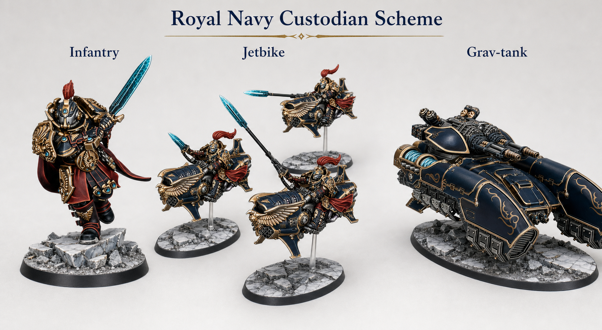
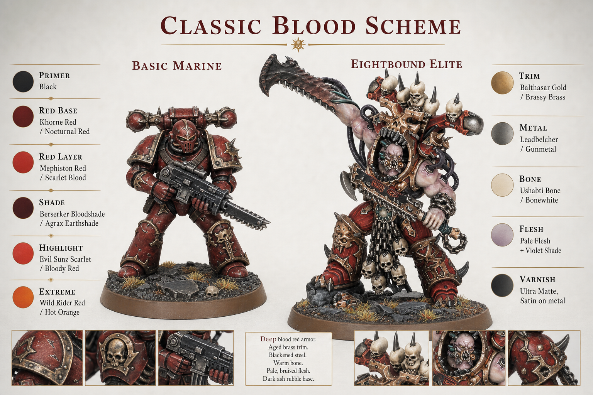

# Warhammer Self Color Book

Warhammer 미니어처를 스스로 칠하기 위한 한국어 페인팅 가이드 모음입니다. 각 폴더는 하나의 독립된 컬러북이며, 준비물, 기본 색 설계, 부위별 레시피, 유닛별 적용 순서를 함께 정리합니다.

## Color Books

| 종류 | 예시 이미지 | 내용 |
|---|---|---|
| [Adeptus Custodes Paint Book](custodes-paint-book/README.md) |  | Royal Navy 계열의 깊은 남색 갑옷과 고급스러운 금장을 중심으로 Custodes 전군의 통일감을 잡는 가이드입니다. |
| [Slaves to Darkness Spearhead Paint Guide](slaves-to-darkness-paint-guide/README.md) |  | 밝게 닦인 강철 판금(A안)과 검게 눌린 철갑(B안) 두 스킴으로 Spearhead 박스를 완성하는 가이드입니다. |
| [World Eaters Classic Blood](world-eaters-classic-blood/README.md) |  | 어두운 피색 갑옷, aged brass trim, blackened steel을 중심으로 World Eaters를 칠하기 위한 기본 도료와 레시피입니다. |

## How to Use

- 처음 시작할 때는 원하는 컬러북의 `README.md` 또는 첫 문서부터 읽으세요.
- 실제 도색 전에는 도료, 브러시, 프라이머, 바니시 챕터를 체크리스트처럼 사용하세요.
- 한 번에 전군을 칠하기보다 기준 모델 1개를 먼저 완성하고, 그 레시피를 나머지 모델에 반복 적용하는 방식을 권장합니다.
- 이미지와 출처 정보가 있는 프로젝트는 각 폴더의 `images/SOURCES.txt`를 확인하세요.

## Books at a Glance

### Adeptus Custodes

- 시작 문서: [custodes-paint-book/README.md](custodes-paint-book/README.md)
- 주요 구성: 기본 이론, 도료 팔레트, 프라이머, 바니시, 부위별 레시피, 유닛별 레시피, 베이싱
- 추천 대상: 고급스러운 남색/금장 Custodes 전군 스킴을 만들고 싶은 사용자

### Slaves to Darkness

- 시작 문서: [slaves-to-darkness-paint-guide/README.md](slaves-to-darkness-paint-guide/README.md)
- 주요 구성: 색 컨셉, 준비 도구, 도료 대체표, 공통 부위 레시피, Spearhead 유닛별 순서
- 스킴: [A안 Pale Steel](slaves-to-darkness-paint-guide/images/scheme-a-pale-steel-reference-sheet.svg) / [B안 Dark Gunmetal](slaves-to-darkness-paint-guide/images/scheme-b-dark-gunmetal-reference-sheet.svg)
- 추천 대상: Slaves to Darkness Spearhead 박스를 밝은 강철(A안) 또는 검은 철갑(B안)으로 완성하려는 사용자

### World Eaters

- 시작 문서: [world-eaters-classic-blood/README.md](world-eaters-classic-blood/README.md)
- 주요 구성: 프라이머 선택, 필수 도료, 최소 구매 세트, red armor, brass trim, steel, bone, flesh 레시피
- 차량 파트: [Mephiston Red 프라이밍](world-eaters-classic-blood/mephiston-red-priming.md), [Chaos Rhino](world-eaters-classic-blood/units/chaos-rhino.md), [Forgefiend](world-eaters-classic-blood/units/forgefiend.md)
- 추천 대상: 밝은 빨강보다 무겁고 어두운 Classic Blood World Eaters 스킴을 원하는 사용자

## Image Notice

이 저장소의 이미지는 도색 참고와 로컬 작업용으로 정리한 자료입니다. Warhammer 관련 이미지의 권리는 각 원 저작권자에게 있으며, 공개 배포나 상업적 사용을 준비할 때는 직접 촬영 이미지, 라이선스 이미지, 또는 명시적 허가를 받은 이미지로 교체하세요.
