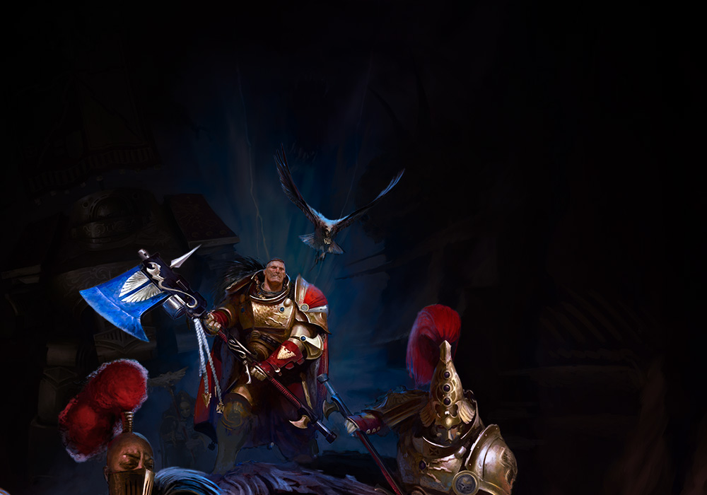

# 01 Introduction

## Introduction

Adeptus Custodes는 한 모델 안에 큰 금속 면, 정교한 장식, 천, 가죽, 에너지 무기, 보석이 모두 들어 있는 군대입니다. 이 책은 전통적인 금색 Custodes에서 출발하되, [Royal Navy Scheme](03-royal-navy-scheme.md)의 차분한 남색 갑옷을 중심으로 더 묵직하고 귀족적인 분위기를 만드는 방법을 다룹니다.

## Theory

좋은 Custodes 도색은 세 가지 균형으로 결정됩니다.

| 요소 | 목표 | 실패하면 생기는 문제 |
|---|---|---|
| 명도 | 멀리서 형태가 읽히는 밝기 차이 | 모델이 검은 덩어리처럼 보임 |
| 금속 광택 | 장식과 갑옷이 서로 분리됨 | 전부 같은 금색으로 뭉침 |
| 반복성 | 분대와 차량이 같은 군대로 보임 | 각 모델이 다른 프로젝트처럼 보임 |

남색 갑옷은 검정에 가까워 보이기 쉽습니다. 그래서 기본색은 어둡게 잡더라도 하이라이트는 과감하게 올려야 합니다. 금장은 따뜻하게, 천과 가죽은 낮은 채도로 두면 주인공인 갑옷과 장식이 살아납니다.

## Recommended Paints

| 역할 | Paint |
|---|---|
| Primer | Vallejo Surface Primer Black, Citadel Chaos Black |
| Navy Base | Vallejo Model Color Dark Prussian Blue, Citadel Kantor Blue |
| Navy Layer | Vallejo Model Color Prussian Blue, AK Interactive Dark Sea Blue |
| Gold Base | Citadel Retributor Armour, Vallejo Metal Color Gold |
| Shade | Citadel Agrax Earthshade, Army Painter Strong Tone |
| Matte Varnish | AK Interactive Ultra Matte, Vallejo Mecha Matte Varnish |

## Alternative Paints

| 색상군 | Vallejo | AK Interactive | Citadel | Army Painter | Two Thin Coats |
|---|---|---|---|---|---|
| 어두운 남색 | Dark Prussian Blue | Deep Blue | Kantor Blue | Deep Blue | Night Sky |
| 밝은 남색 | Prussian Blue | Dark Sea Blue | Altdorf Guard Blue | Crystal Blue | Marine Blue |
| 따뜻한 금 | Metal Color Gold | Old Gold | Retributor Armour | Greedy Gold | Dragon's Gold |
| 갈색 쉐이드 | Umber Wash | Brown Wash | Agrax Earthshade | Strong Tone | Oblivion Black Wash |

## Recommended Tools

- 습식 팔레트
- 0, 1, 2호 라운드 브러시
- 낡은 드라이브러시
- 몰드라인 제거용 나이프
- 핀 바이스와 황동봉
- 확대경 또는 데스크 램프

## Difficulty

| 등급 | 설명 |
|---|---|
| Beginner | 프라이머, 베이스, 쉐이드, 간단한 하이라이트 |
| Intermediate | 글레이즈, 레이어링, 엣지 하이라이트 |
| Advanced | NMM 감각의 금속 배치, OSL, 차량 패널 변조 |

## Time Required

| 대상 | 권장 시간 |
|---|---|
| 보병 1명 | 3~6시간 |
| 캐릭터 1명 | 8~15시간 |
| Dreadnought | 12~25시간 |
| Grav-tank | 15~30시간 |

## Step-by-Step Process

1. 조립 전 몰드라인과 게이트 자국을 제거합니다.
2. 큰 부품은 서브어셈블리로 나누고 핀으로 고정할 준비를 합니다.
3. 블랙 또는 다크 그레이 프라이머를 얇게 2회 분사합니다.
4. 남색 갑옷, 금장, 천, 가죽 순서로 큰 색면을 정리합니다.
5. 쉐이드는 전체 워시가 아니라 홈과 접합부에 집중합니다.
6. 하이라이트는 얼굴, 무기, 어깨, 흉갑처럼 시선이 먼저 닿는 곳을 우선합니다.
7. 베이스를 완성한 뒤 바니시로 광택을 통일합니다.

## Core Painting Recipe

| Stage | Paint | Purpose |
|---|---|---|
| Primer | Vallejo Surface Primer Black | 깊은 그림자 확보 |
| Base | Dark Prussian Blue | Royal Navy 갑옷의 기준색 |
| Layer | Prussian Blue | 큰 면의 상단 명도 상승 |
| Shade | Agrax Earthshade + Lahmian Medium | 패널 사이의 깊이 |
| Highlight | Dark Sea Blue | 엣지와 돌출부 정리 |
| Extreme Highlight | Fenrisian Grey 소량 혼합 | 가장 날카로운 모서리 |
| Optional Weathering | Rhinox Hide 스펀지 칩 | 전투 흔적 |
| Optional Airbrush Method | Black primer 후 Dark Prussian Blue zenithal | 빠른 명암 |
| Brush-only Method | 얇은 레이어 3회로 베이스 구축 | 장비 없이 재현 가능 |
| Recommended Varnish | AK Interactive Ultra Matte + 금속부 Satin | 갑옷은 차분하게, 금속은 살아 있게 |

## Common Mistakes

- 남색을 한 번에 두껍게 올려 표면이 거칠어지는 것
- 금장 전체에 워시를 흘려 넣어 탁한 갈색으로 만드는 것
- 모든 엣지를 같은 밝기로 칠해 시선 집중점이 사라지는 것
- 베이스와 모델의 색온도를 전혀 고려하지 않는 것

> ⚠ 너무 두꺼운 레이어는 남색 갑옷의 명암을 모두 죽입니다. 물 또는 아크릴 미디엄으로 희석하고, 한 번에 덮으려 하지 마세요.

## Professional Tips

💡 Pro Tip

한 번에 최고 퀄리티를 목표로 하기보다 "전군 기준 모델"을 먼저 만드세요. Custodian Guard 한 명을 기준으로 사진을 찍어두면 차량과 캐릭터를 칠할 때 색이 흔들리지 않습니다.

💡 Pro Tip

금색은 밝기보다 온도 차이가 중요합니다. 어두운 홈에는 갈색, 가장 밝은 모서리에는 은색을 조금 섞은 금색을 써야 장식이 고급스럽게 보입니다.

## Summary

이 책의 핵심은 반복 가능한 고급 도색입니다. [Workflow](11-workflow.md)를 기본 뼈대로 삼고, [Armor Recipe](armor/10-armor.md)와 [Gold](armor/11-gold.md)를 전군 공통 기준으로 사용하면 작은 보병부터 [Caladius Grav-tank](units/caladius.md)까지 같은 세계관 안에 묶을 수 있습니다.

## Checklist

- [ ] 기준 모델을 하나 정했다.
- [ ] 프라이머와 바니시를 테스트했다.
- [ ] 남색, 금색, 천, 가죽의 대체 도료를 준비했다.
- [ ] 전군 베이스 테마를 하나 선택했다.
- [ ] 작업 순서를 [Workflow](11-workflow.md)에 맞춰 정리했다.

