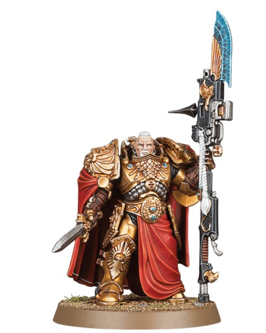

# 04 Color Theory

## Introduction

도색에서 색 이론은 어려운 용어를 외우는 일이 아니라, 모델이 테이블 위에서 어떻게 읽히는지 통제하는 도구입니다. Custodes처럼 장식이 많은 모델은 색을 많이 쓰기보다 색의 역할을 분명히 해야 고급스럽습니다.

## Theory

### 명도

명도는 가장 중요합니다. 어두운 남색 갑옷은 하이라이트 없이는 형태가 읽히지 않습니다. 반대로 금장은 너무 밝게만 가면 무게가 사라집니다.

### 채도

채도는 색의 강도입니다. Royal Navy 스킴에서는 갑옷의 채도를 낮게, 에너지와 보석의 채도를 높게 두면 시선이 자연스럽게 이동합니다.

### 색온도

따뜻한 금장과 차가운 남색은 서로를 강화합니다. 천을 붉은색으로 선택하면 금장과 연결되고, 에너지를 청록색으로 선택하면 갑옷과 연결됩니다.

| 개념 | Custodes 적용 | 추천 조절 |
|---|---|---|
| 명도 대비 | 갑옷과 엣지 | 하이라이트를 좁게 올림 |
| 온도 대비 | 남색과 금색 | 금장은 갈색 쉐이드 사용 |
| 채도 대비 | 갑옷과 보석 | 보석만 선명하게 |

## Recommended Paints

| 용도 | Paint |
|---|---|
| 차가운 그림자 | Drakenhof Nightshade, Nuln Oil |
| 따뜻한 그림자 | Agrax Earthshade, Reikland Fleshshade |
| 채도 높은 포인트 | Temple Guard Blue, Evil Sunz Scarlet |
| 명도 상승 | Fenrisian Grey, Ivory |

## Alternative Paints

| 역할 | Vallejo | AK Interactive | Citadel | Army Painter | Two Thin Coats |
|---|---|---|---|---|---|
| 차가운 밝힘 | Glacier Blue | Pale Grey Blue | Fenrisian Grey | Wolf Grey | Ethereal Blue |
| 따뜻한 그림자 | Brown Wash | Brown Wash | Agrax Earthshade | Strong Tone | Sepia Wash |
| 붉은 포인트 | Scarlet | Deep Red | Mephiston Red | Pure Red | Sanguine Scarlet |
| 아이보리 | Ivory | Ivory | Wraithbone | Skeleton Bone | Trooper White |

## Recommended Tools

- 컬러 휠 또는 색상표
- 테스트 스푼
- 사진 촬영용 중립 배경
- 습식 팔레트
- 조명 색온도 5000K 내외의 램프

## Difficulty

Beginner to Advanced. 기본 개념은 쉽지만, 실제 모델에 좁고 정확하게 적용하는 데 연습이 필요합니다.

## Time Required

| 작업 | 시간 |
|---|---|
| 팔레트 테스트 | 30~60분 |
| 기준 모델 색 검증 | 1~2시간 |

## Step-by-Step Process

1. 갑옷, 금장, 천, 무기, 베이스의 색 역할을 적습니다.
2. 가장 어두운 색과 가장 밝은 색을 먼저 정합니다.
3. 보석과 에너지는 갑옷보다 밝고 채도 높게 잡습니다.
4. 베이스는 모델보다 낮은 채도 또는 중립 색으로 둡니다.
5. 완성 전 사진을 찍어 흑백으로 확인합니다. 흑백에서 형태가 읽히면 명도 설계가 성공한 것입니다.

## Contrast Recipe

| Stage | Paint | Purpose |
|---|---|---|
| Primer | Black | 전체 그림자 기준 |
| Base | Dark Prussian Blue | 낮은 명도 중심 |
| Layer | Prussian Blue | 중간 명도 |
| Shade | Drakenhof Nightshade | 차가운 깊이 |
| Highlight | Fenrisian Grey 혼합 | 명도 대비 |
| Extreme Highlight | Ivory 소량 혼합 | 극소 시선점 |
| Optional Weathering | Neutral Grey 칩 | 채도 낮은 손상 |
| Optional Airbrush Method | 흑백 프리쉐이딩 후 투명 남색 | 명도 지도 확보 |
| Brush-only Method | 흑백 스케치 위 얇은 글레이즈 | 색과 명도 분리 |
| Recommended Varnish | Ultra Matte | 색 대비 안정화 |

## Common Mistakes

- 예쁜 색을 많이 쓰면 고급스러워질 것이라고 생각하는 것
- 모든 부위를 같은 밝기까지 올리는 것
- 베이스 색이 모델보다 강해 시선을 빼앗는 것

> ⚠ 색상보다 명도가 먼저입니다. 색이 마음에 들어도 흑백 사진에서 형태가 안 보이면 게임 테이블에서는 더 안 보입니다.

## Professional Tips

💡 Pro Tip

하이라이트 색에 흰색만 섞으면 색이 분필처럼 죽을 수 있습니다. 남색에는 Fenrisian Grey, 금색에는 Silver, 붉은 천에는 Orange Brown 계열을 섞는 편이 자연스럽습니다.

💡 Pro Tip

Army Painter Speedpaint나 Citadel Contrast를 쓸 때도 색 이론은 같습니다. 투명 도료는 밑색 명도를 그대로 보여주므로 프리쉐이딩이 특히 중요합니다.

## Summary

색 이론은 선택을 줄이는 기술입니다. 이 장의 원칙을 [Color Palette](05-color-palette.md)에 적용하고, 실제 부위별 사용법은 [Armor Recipe](armor/10-armor.md)와 [Capes](armor/18-capes.md)에서 확인하세요.

## Checklist

- [ ] 가장 어두운 색과 가장 밝은 색을 정했다.
- [ ] 포인트 색을 1~2개로 제한했다.
- [ ] 흑백 사진으로 명도 대비를 확인했다.
- [ ] 베이스가 모델을 방해하지 않는다.
- [ ] 금장과 갑옷의 온도 차이가 분명하다.

