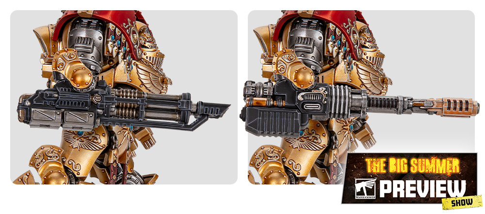

# 09 Tools

## Introduction

도구는 완성도를 높이는 동시에 실수를 줄입니다. Custodes는 장식이 많아 조립 단계의 몰드라인, 접합선, 손잡이 준비가 도색 결과에 크게 드러납니다.

## Theory

도구는 세 범주로 나눕니다.

| 범주 | 목적 | 예시 |
|---|---|---|
| 준비 도구 | 표면 품질 | 니퍼, 나이프, 사포 |
| 도색 도구 | 색과 명암 | 팔레트, 브러시, 에어브러시 |
| 마감 도구 | 내구성과 전시 | 바니시, 피그먼트, 베이스 재료 |

### 에어브러시 45도 분사의 의미

이 책에서 "45도로 칠한다"는 표현은 에어브러시를 모델보다 위쪽에 두고, 위에서 아래로 비스듬히 분사한다는 뜻입니다. 각도기를 맞추듯 정확히 45도를 재는 작업이 아니라, 위에서 들어오는 빛을 흉내 내는 방식입니다.

| 분사 위치 | 각도 감각 | 결과 |
|---|---|---|
| 모델 정면 수평 | 0도에 가까움 | 전체가 같은 밝기로 덮임 |
| 모델보다 위쪽 사선 | 약 45도 | 상단 면이 밝고 하단은 어둡게 남음 |
| 모델 바로 위 | 90도에 가까움 | 머리, 어깨, 상단 패널만 강하게 밝아짐 |

Royal Navy 갑옷에서는 Black primer 후 `Dark Prussian Blue`를 전체에 얇게 올리고, `Dark Sea Blue`를 위쪽 45도 방향에서 분사합니다. 이렇게 하면 겨드랑이, 허벅지 안쪽, 장식 아래쪽은 자연스럽게 어둡게 남습니다.

> ⚠ 45도 분사는 아래쪽까지 완전히 덮는 기술이 아닙니다. 아래쪽이 조금 어둡게 남아야 갑옷의 볼륨이 살아납니다.

## Recommended Paints

| 작업 | Paint |
|---|---|
| 서페이스 확인 | Grey Primer |
| 접합선 확인 | Nuln Oil 얇은 워시 |
| 베이스 질감 | Vallejo Earth Texture |
| 피그먼트 고정 | AK Interactive Pigment Fixer |

## Alternative Paints

| 용도 | Vallejo | AK Interactive | Citadel | Army Painter | Two Thin Coats |
|---|---|---|---|---|---|
| 텍스처 | Earth Texture | Terrains | Technical Texture | Battlefields | 없음 |
| 피그먼트 | Pigments | Pigments | 없음 | 없음 | 없음 |
| 접착 보조 | Plastic Putty | Putty | Liquid Green Stuff | Green Stuff | 없음 |

## Recommended Tools

- 정밀 니퍼
- 몰드라인 리무버 또는 하비 나이프
- 600, 1000, 2000방 사포
- 핀 바이스
- 황동봉 또는 클립
- 마스킹 테이프
- 습식 팔레트
- 에어브러시와 컴프레서

### 에어브러시 관련 도구

| Tool | Recommended Spec | Purpose |
|---|---|---|
| 에어브러시 | 0.3mm 노즐, 더블 액션 | 갑옷 베이스, zenithal, 바니시 |
| 컴프레서 | 수분 트랩 포함, 압력 조절 가능 | 일정한 분사 |
| Airbrush Thinner | Vallejo Airbrush Thinner, AK Interactive Thinner | 도료 점도 조절 |
| Flow Improver | Vallejo Flow Improver | 팁 마름 감소 |
| 클리닝 팟 | 유리 또는 금속 필터 포함 | 세척액 분사 안전 처리 |
| 니들 클리너 | 전용 클리너 또는 부드러운 브러시 | 노즐 막힘 예방 |
| 마스킹 테이프 | Tamiya Masking Tape | 차량 패널 분리 |
| 악어 클립 홀더 | 회전 가능한 스탠드 | 여러 각도에서 분사 |

### 마커 관련 도구

| Tool | Recommended Spec | Purpose |
|---|---|---|
| 모델링용 아크릴 마커 | 0.7~1mm fine tip | 렌즈, 관절, 칩, 작은 장식 |
| 크롬 마커 | 1mm tip | 무기 날 끝, 렌즈 반사, 금속 극점 |
| 여분 팁 | 제조사 호환 팁 | 막힘 또는 마모 대비 |
| 테스트 카드 | Black/Grey/White primer 카드 | 실제 발색 확인 |
| 면봉 | 뾰족한 타입 | 마커 번짐 즉시 정리 |
| Gloss Varnish | 작은 브러시 적용 | 보석과 렌즈 마감 |

마커는 눌러서 잉크를 공급하는 구조가 많으므로, 모델 위에서 바로 펌핑하지 않습니다. 테스트 카드나 팔레트 위에서 먼저 잉크 흐름을 맞춘 뒤 모델에 가져가야 과다 토출을 피할 수 있습니다.

💡 Pro Tip

처음에는 0.3mm 노즐 하나면 충분합니다. 0.2mm는 더 정밀하지만 막힘에 민감하고, 0.5mm는 차량과 프라이머에는 좋지만 보병 갑옷 명암에는 넓게 뿌려질 수 있습니다.

### 기본 압력과 희석

| 작업 | 압력 감각 | 희석 감각 |
|---|---|---|
| Primer | 약간 높게 | 전용 primer는 제품 지시 우선 |
| Basecoat | 중간 | 도료가 우유처럼 흐르는 정도 |
| 45도 Layer | 중간보다 낮게 | 얇게 여러 번 |
| OSL | 낮게 | 매우 묽게, 가까운 거리 |
| Varnish | 중간 | 막히지 않을 정도로 얇게 |

## Difficulty

Beginner to Intermediate. 도구 사용은 단순하지만, 차량과 Dreadnought의 접합선 처리는 시간이 필요합니다.

## Time Required

| 작업 | 시간 |
|---|---|
| 보병 준비 | 10~20분 |
| 캐릭터 서브어셈블리 | 30~60분 |
| 차량 표면 정리 | 1~3시간 |

## Step-by-Step Process

1. 니퍼로 게이트를 조금 남기고 자릅니다.
2. 나이프와 사포로 게이트 자국을 평평하게 만듭니다.
3. 몰드라인을 빛에 비춰 확인합니다.
4. 큰 무기와 망토는 서브어셈블리로 나눌지 판단합니다.
5. 핀 바이스로 고정 구멍을 만들고 도색 손잡이에 붙입니다.
6. 접합선은 퍼티로 메우고 사포로 정리합니다.
7. 에어브러시를 쓸 경우 테스트 스푼에 먼저 분사해 도료 흐름과 분사 폭을 확인합니다.
8. 45도 분사는 모델을 돌려가며 앞, 좌, 우, 뒤에서 같은 높이로 짧게 반복합니다.
9. 마커를 쓸 경우 모델에 닿기 전에 테스트 카드에서 잉크 양을 안정시킵니다.

## Preparation Recipe

| Stage | Paint | Purpose |
|---|---|---|
| Primer | Grey Primer 얇은 테스트 | 표면 결함 확인 |
| Base | 없음 | 조립 단계 |
| Layer | 없음 | 조립 단계 |
| Shade | Nuln Oil 희석 | 접합선 확인용 |
| Highlight | 없음 | 조립 단계 |
| Extreme Highlight | 없음 | 조립 단계 |
| Optional Weathering | 사포 스크래치 정리 | 차량 표면 준비 |
| Optional Airbrush Method | Grey Primer 먼지분사 | 결함 확인 |
| Brush-only Method | 붓 프라이머로 국소 확인 | 작은 부품 |
| Recommended Varnish | 없음 | 마감 전 단계 |

## Common Mistakes

- 게이트 자국을 남긴 채 프라이머를 올리는 것
- 서브어셈블리를 너무 많이 나눠 조립 강도가 떨어지는 것
- 순간접착제를 과하게 사용해 표면이 하얗게 뜨는 것
- 에어브러시를 너무 가까이 대고 한 번에 덮어 도료가 고이는 것
- 마커를 모델 위에서 펌핑해 잉크가 한꺼번에 쏟아지는 것

> ⚠ 도색으로 몰드라인을 숨길 수는 없습니다. 금장 하이라이트가 몰드라인 위에 걸리면 오히려 더 잘 보입니다.

> ⚠ 에어브러시 도료가 거미줄처럼 날리면 너무 진하거나 압력이 높을 가능성이 큽니다. 표면에 물방울처럼 고이면 너무 묽거나 한 지점에 오래 분사한 것입니다.

## Professional Tips

💡 Pro Tip

Custodes spear는 긴 직선이 많아 휨이 눈에 잘 띕니다. 프라이머 전에 창대를 정면, 측면, 위에서 확인하세요.

💡 Pro Tip

차량은 조립 전에 마스킹 계획을 세우세요. [Caladius Grav-tank](units/caladius.md)는 패널별로 색을 나누면 훨씬 깔끔합니다.

💡 Pro Tip

에어브러시로 만든 명암은 마지막 결과가 아니라 밑그림입니다. 최종 선명도는 [Armor Recipe](armor/10-armor.md)의 붓 엣지 하이라이트로 완성하세요.

💡 Pro Tip

마커는 베이스 림을 검정으로 정리할 때도 편합니다. 단, 림을 칠한 직후 손으로 잡으면 지문이 남을 수 있으니 완전히 마른 뒤 만지세요.

## Summary

좋은 도색은 좋은 표면에서 시작합니다. 준비 단계는 느려 보이지만 [Varnish](10-varnish.md)와 [Workflow](11-workflow.md)까지 이어지는 전체 품질을 결정합니다.

## Checklist

- [ ] 게이트 자국을 제거했다.
- [ ] 몰드라인을 빛에 비춰 확인했다.
- [ ] 필요한 부품을 서브어셈블리로 나눴다.
- [ ] 접합선을 퍼티로 정리했다.
- [ ] 프라이머 전 먼지를 제거했다.
- [ ] 에어브러시 압력과 희석을 테스트 스푼에서 확인했다.
- [ ] 45도 분사 후 하단 그림자가 남아 있다.
- [ ] 마커는 테스트 카드에서 잉크 흐름을 먼저 안정시켰다.
