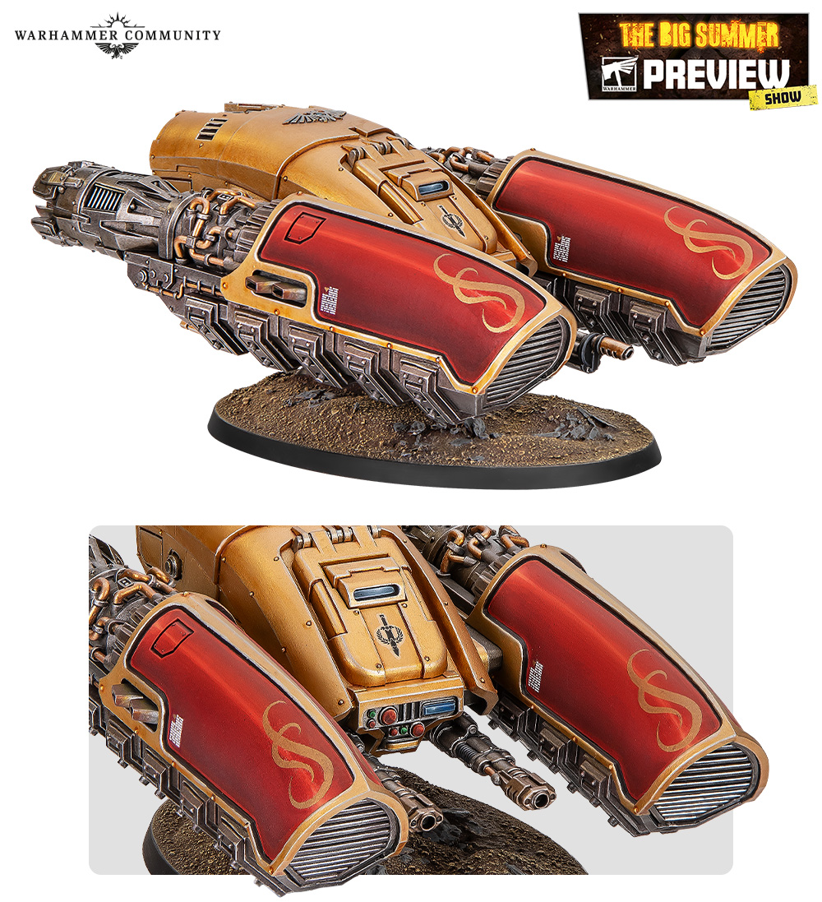

# 10 Varnish

## Introduction

바니시는 도색을 보호하고 광택을 통일합니다. Royal Navy Custodes에서는 바니시 선택이 색감에 큰 영향을 줍니다. 남색 갑옷은 무광에 가까울수록 고급스럽고, 금장은 새틴 광택이 남아야 금속답습니다.

## Theory

| Varnish | 효과 | 추천 영역 |
|---|---|---|
| Gloss | 가장 강한 보호, 높은 광택 | 데칼 전, 보석 |
| Satin | 자연스러운 반광 | 금속, 가죽 |
| Matte | 광택 억제 | 천, 베이스 |
| Ultra Matte | 매우 차분한 마감 | Royal Navy 갑옷 |

## Recommended Paints

| 용도 | Paint |
|---|---|
| 갑옷 | AK Interactive Ultra Matte |
| 금장 | Vallejo Mecha Satin Varnish |
| 보석 | Citadel Ardcoat |
| 게임용 보호 | Vallejo Mecha Gloss 후 Matte |

## Alternative Paints

| 마감 | Vallejo | AK Interactive | Citadel | Army Painter | Two Thin Coats |
|---|---|---|---|---|---|
| Gloss | Mecha Gloss | Gauzy Agent Shine Enhancer | Ardcoat | Gloss Varnish | Gloss Varnish |
| Satin | Mecha Satin | Satin Varnish | Stormshield | Satin Varnish | Satin Varnish |
| Matte | Mecha Matte | Matte Varnish | Munitorum Varnish | Anti-Shine | Matte Varnish |
| Ultra Matte | 없음 | Ultra Matte | 없음 | 없음 | 없음 |

## Recommended Tools

- 에어브러시
- 바니시 전용 브러시
- 마스크
- 습도계
- 테스트 스푼
- 데칼용 Micro Set, Micro Sol

## Difficulty

Intermediate. 바니시는 마지막 단계라 실수의 심리적 부담이 큽니다. 반드시 테스트 후 적용하세요.

## Time Required

| 작업 | 시간 |
|---|---|
| 테스트 | 15분 |
| 보병 분대 바니시 | 10분 |
| 완전 경화 | 24시간 |

## Step-by-Step Process

1. 모델 표면의 먼지를 제거합니다.
2. 테스트 스푼에 같은 도료를 칠하고 바니시를 먼저 시험합니다.
3. 전체 보호가 필요하면 Gloss를 얇게 올리고 완전 건조합니다.
4. 갑옷과 천에는 Matte 또는 Ultra Matte를 올립니다.
5. 금장과 가죽에는 Satin을 브러시로 선택 적용합니다.
6. 보석에는 마지막에 Gloss를 점으로 올립니다.

## Varnish Recipe

| Stage | Paint | Purpose |
|---|---|---|
| Primer | 없음 | 이미 완료된 도색 위 작업 |
| Base | Gloss Varnish 선택 | 내구성 |
| Layer | Ultra Matte | 갑옷 광택 억제 |
| Shade | 없음 | 색층 보호 단계 |
| Highlight | Satin Varnish | 금속 광택 회복 |
| Extreme Highlight | Gloss Varnish | 보석 반짝임 |
| Optional Weathering | Pigment Fixer 후 Matte | 피그먼트 고정 |
| Optional Airbrush Method | Ultra Matte 2회 얇게 | 균일한 마감 |
| Brush-only Method | 작은 영역별 바니시 | 광택 분리 |
| Recommended Varnish | AK Interactive Ultra Matte + Vallejo Mecha Satin | 최종 조합 |

## Common Mistakes

- 습한 날 무광 바니시를 뿌려 하얗게 뜨는 것
- 금속부까지 Ultra Matte로 덮어 금장이 죽는 것
- 한 번에 두껍게 분사해 표면이 끈적이는 것

> ⚠ 무광 바니시가 하얗게 뜨면 완전히 마른 뒤 Gloss Varnish를 얇게 올려 일부 회복할 수 있습니다. 하지만 예방이 훨씬 쉽습니다.

## Professional Tips

💡 Pro Tip

게임용 모델은 Gloss로 보호한 뒤 Matte로 광택을 낮추는 이중 마감이 좋습니다. 단, 디테일이 묻히지 않도록 두 층 모두 매우 얇게 올려야 합니다.

💡 Pro Tip

[Gems](armor/16-gems.md)는 전체 무광 후 마지막에 Gloss를 찍어야 가장 선명합니다.

## Summary

바니시는 색을 끝내는 단계가 아니라 질감을 설계하는 단계입니다. 갑옷, 금장, 보석의 광택을 다르게 두면 같은 도료라도 훨씬 전문적인 결과가 됩니다.

## Checklist

- [ ] 바니시를 테스트 스푼에 먼저 시험했다.
- [ ] 습도와 온도를 확인했다.
- [ ] 갑옷과 금속부의 광택을 분리했다.
- [ ] 보석에는 마지막에 Gloss를 올렸다.
- [ ] 완전 경화 전 모델을 만지지 않았다.

