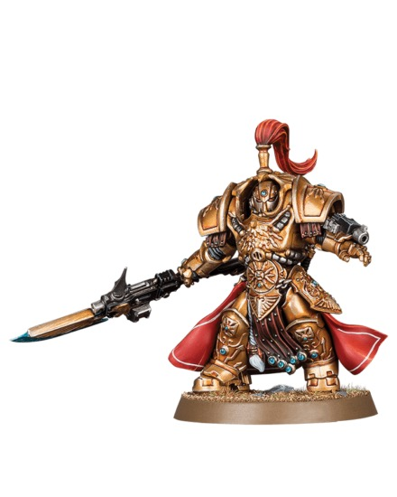

# FAQ

## Introduction

이 장은 Adeptus Custodes Royal Navy 스킴을 칠하면서 자주 생기는 질문을 정리합니다. 짧은 답만이 아니라 실제 선택 기준을 함께 적었습니다.

## Theory

좋은 답은 상황에 따라 달라집니다. 같은 도료라도 목표가 tabletop인지 display인지, 붓만 쓰는지 에어브러시를 쓰는지에 따라 선택이 달라집니다.

## Recommended Paints

| 질문 | 추천 Paint |
|---|---|
| 갑옷이 너무 검게 보일 때 | Prussian Blue, Fenrisian Grey |
| 금장이 탁할 때 | Liberator Gold, Stormhost Silver |
| 에너지가 흐릴 때 | White Scar 밑칠 후 Sotek Green |
| 마감이 번들거릴 때 | AK Interactive Ultra Matte |

## Alternative Paints

| 문제 | Vallejo | AK Interactive | Citadel | Army Painter | Two Thin Coats |
|---|---|---|---|---|---|
| 밝은 남색 | Prussian Blue | Dark Sea Blue | Altdorf Guard Blue | Crystal Blue | Marine Blue |
| 극점 | Glacier Blue | Pale Grey Blue | Fenrisian Grey | Wolf Grey | Ethereal Blue |
| 금장 회복 | Metal Color Gold | Old Gold | Liberator Gold | Bright Gold | Glistening Gold |
| 흰 밑칠 | White | White | White Scar | Matt White | Trooper White |

## Recommended Tools

- 테스트 모델
- 색상 카드
- 사진 촬영 조명
- 습식 팔레트

## Difficulty

Beginner. 질문의 대부분은 기준 모델과 테스트 카드로 해결됩니다.

## Time Required

| 작업 | 시간 |
|---|---|
| 색 문제 진단 | 10분 |
| 작은 테스트 | 20~30분 |

## Step-by-Step Process

1. 문제 부위를 자연광과 작업등에서 모두 확인합니다.
2. 사진을 찍어 실제 게임 거리에서 읽히는지 봅니다.
3. 색이 어두우면 하이라이트를 추가하고, 색이 밝으면 글레이즈로 낮춥니다.
4. 광택 문제는 바니시 테스트 후 수정합니다.
5. 같은 해결을 분대 전체에 적용하기 전 한 모델에서 검증합니다.

## FAQ Recipe

| Stage | Paint | Purpose |
|---|---|---|
| Primer | Black | 기준 유지 |
| Base | Dark Prussian Blue | 갑옷 복구 기준 |
| Layer | Prussian Blue | 어두움 해결 |
| Shade | Drakenhof Nightshade diluted | 과한 밝기 조정 |
| Highlight | Fenrisian Grey | 엣지 가독성 |
| Extreme Highlight | White Scar | 보석/에너지 |
| Optional Weathering | Rhinox Hide | 작은 흠 가리기 |
| Optional Airbrush Method | 얇은 필터 | 큰 면 색 조정 |
| Brush-only Method | 글레이즈와 엣지 수정 | 대부분 해결 |
| Recommended Varnish | Ultra Matte 또는 Satin | 광택 조정 |

## Common Mistakes

- 문제를 실제 게임 거리에서 확인하지 않는 것
- 인터넷 사진과 내 작업등 아래 색을 직접 비교하는 것
- 같은 문제를 모든 모델에 적용하기 전 테스트하지 않는 것

> ⚠ 사진 속 색은 조명과 보정의 영향을 크게 받습니다. 목표는 사진 복제가 아니라 전군 일관성입니다.

## Professional Tips

💡 Pro Tip

질문이 생기면 먼저 [Common Mistakes](common-mistakes.md)를 보고, 그다음 관련 부위 챕터로 돌아가세요.

## Summary

FAQ의 핵심은 문제를 작게 나누고 테스트 후 적용하는 것입니다. 대부분의 색 문제는 하이라이트 폭, 글레이즈, 바니시로 해결됩니다.

## Checklist

- [ ] 문제를 사진과 실제 거리에서 확인했다.
- [ ] 한 모델에서 먼저 테스트했다.
- [ ] 색 문제와 광택 문제를 구분했다.
- [ ] 관련 부위 챕터를 다시 확인했다.
- [ ] 수정 결과를 기록했다.

