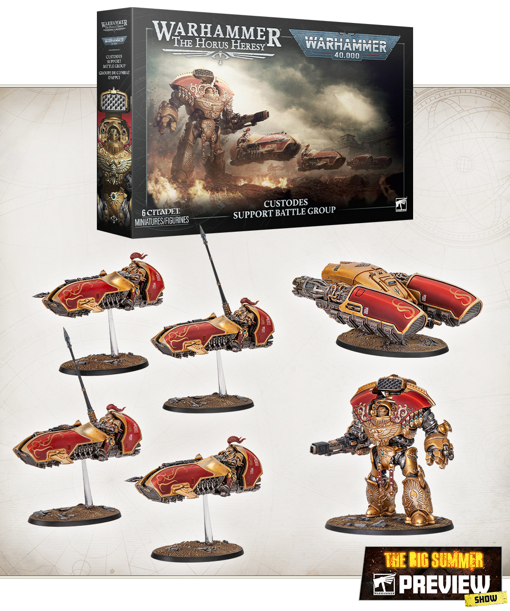

# References

## Introduction

이 장은 책의 레시피를 유지하고 확장하기 위한 참고 기준입니다. 특정 사진을 그대로 복제하기보다, 색 역할과 재질 표현을 일관되게 유지하는 데 목적이 있습니다.

## Theory

참고 자료는 세 종류로 나눠 보세요.

| 자료 | 용도 | 주의점 |
|---|---|---|
| 공식 박스아트 | 장식 위치와 시선점 | 색은 조명 보정 가능 |
| 실제 재질 사진 | 금속, 천, 대리석 이해 | 미니어처 스케일에 맞게 단순화 |
| 본인 기준 모델 | 전군 통일 | 가장 중요한 레퍼런스 |

## Recommended Paints

| 기준 | Paint |
|---|---|
| Navy Reference | Dark Prussian Blue, Prussian Blue |
| Gold Reference | Retributor Armour, Liberator Gold |
| Cloth Reference | Khorne Red, Wazdakka Red |
| Base Reference | Celestra Grey, Ulthuan Grey |

## Alternative Paints

| 기준 | Vallejo | AK Interactive | Citadel | Army Painter | Two Thin Coats |
|---|---|---|---|---|---|
| Navy | Dark Prussian Blue | Deep Blue | Kantor Blue | Deep Blue | Night Sky |
| Gold | Metal Color Gold | Old Gold | Retributor Armour | Greedy Gold | Dragon's Gold |
| Red | Black Red | Deep Red | Khorne Red | Chaotic Red | Sanguine Scarlet |
| Marble | Neutral Grey | Neutral Grey | Celestra Grey | Uniform Grey | Dungeon Stone |

## Recommended Tools

- 레퍼런스 보드
- 색상 카드
- 사진 촬영용 중립 배경
- 파일명 규칙
- 작업 노트

## Difficulty

Beginner. 좋은 레퍼런스 관리는 도색보다 쉽지만 장기 프로젝트에서 큰 차이를 만듭니다.

## Time Required

| 작업 | 시간 |
|---|---|
| 기준 모델 촬영 | 15분 |
| 레퍼런스 보드 정리 | 30~60분 |

## Step-by-Step Process

1. 기준 모델을 앞, 뒤, 좌, 우, 위에서 촬영합니다.
2. 도료명과 희석 비율을 파일명 또는 노트에 적습니다.
3. 색상 카드를 함께 사진에 넣습니다.
4. 새 유닛을 시작하기 전 기준 사진을 확인합니다.
5. 색을 바꿨다면 [README](../README.md)의 프로젝트 기준을 업데이트합니다.

## Reference Recipe

| Stage | Paint | Purpose |
|---|---|---|
| Primer | Black | 기준 출발점 기록 |
| Base | Dark Prussian Blue | 기준 갑옷 |
| Layer | Prussian Blue | 명도 기준 |
| Shade | Drakenhof Nightshade | 홈 기준 |
| Highlight | Fenrisian Grey | 극점 기준 |
| Extreme Highlight | White Scar | 보석/에너지 기준 |
| Optional Weathering | Rhinox Hide | 웨더링 기준 |
| Optional Airbrush Method | 분사 각도 기록 | 재현성 |
| Brush-only Method | 희석 비율 기록 | 재현성 |
| Recommended Varnish | Ultra Matte, Satin | 최종 색 기준 |

## Common Mistakes

- 인터넷 이미지 색을 절대 기준으로 삼는 것
- 완성 모델 사진을 남기지 않는 것
- 도료 희석 비율을 기록하지 않는 것

> ⚠ 장기 프로젝트에서 기억은 믿을 수 있는 도구가 아닙니다. 기준 모델 사진과 도료 기록을 남기세요.

## Professional Tips

💡 Pro Tip

매 분대 첫 모델을 "작은 기준 모델"로 촬영하세요. 전군 기준과 유닛별 특성을 동시에 관리할 수 있습니다.

## Summary

레퍼런스 관리는 전군 통일감을 지키는 가장 현실적인 방법입니다. 이 책의 모든 레시피는 기준 모델 사진과 함께 사용할 때 가장 안정적입니다.

## Checklist

- [ ] 기준 모델 사진을 촬영했다.
- [ ] 도료명과 희석 비율을 기록했다.
- [ ] 바니시 후 사진을 남겼다.
- [ ] 새 유닛 전 기준 사진을 확인했다.
- [ ] 변경 사항을 프로젝트 문서에 반영했다.

