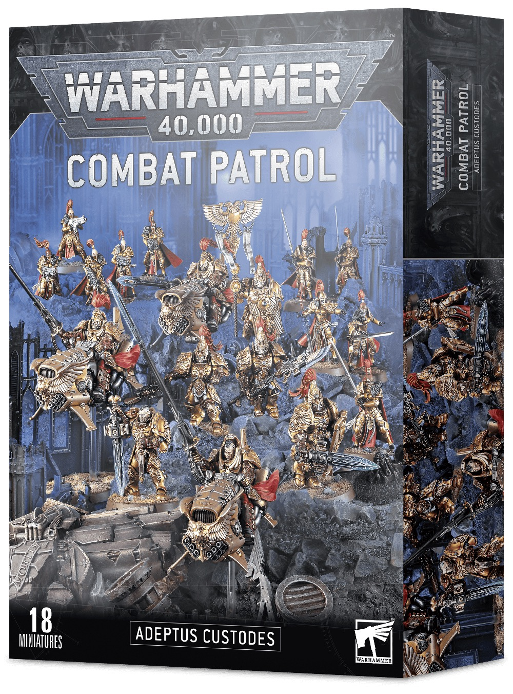

# Shopping List

## Introduction

이 장은 Adeptus Custodes Royal Navy 스킴을 시작하기 위한 구매 우선순위입니다. 모든 도료를 한 번에 살 필요는 없습니다. 기준 모델을 완성할 핵심 세트부터 준비하세요.

## Theory

구매는 "필수, 확장, 전시용"으로 나누면 낭비가 줄어듭니다.

## Recommended Paints

| 우선순위 | Paint | 용도 |
|---|---|---|
| 필수 | Dark Prussian Blue | 갑옷 |
| 필수 | Retributor Armour | 금장 |
| 필수 | Agrax Earthshade | 금장 쉐이드 |
| 필수 | Prussian Blue | 갑옷 하이라이트 |
| 필수 | AK Interactive Ultra Matte | 최종 마감 |
| 확장 | Sotek Green, White Scar | 에너지와 보석 |
| 확장 | Khorne Red, Wazdakka Red | 천 |
| 전시용 | Fenrisian Grey, Stormhost Silver | 극점 |

## Alternative Paints

| 키트 | Vallejo | AK Interactive | Citadel | Army Painter | Two Thin Coats |
|---|---|---|---|---|---|
| Navy Kit | Dark Prussian Blue, Prussian Blue | Deep Blue, Dark Sea Blue | Kantor Blue, Altdorf Guard Blue | Deep Blue, Crystal Blue | Night Sky, Marine Blue |
| Gold Kit | Metal Color Gold, Silver | Old Gold, Natural Steel | Retributor Armour, Stormhost Silver | Greedy Gold, Shining Silver | Dragon's Gold, Sir Coates Silver |
| Cloth Kit | Black Red, Scarlet | Deep Red | Khorne Red, Wazdakka Red | Chaotic Red, Pure Red | Sanguine Scarlet, Demon Red |

## Recommended Tools

| 우선순위 | Tool |
|---|---|
| 필수 | 니퍼, 하비 나이프, 1호 브러시, 습식 팔레트 |
| 권장 | 0호 브러시, 브러시 비누, 도색 손잡이 |
| 확장 | 에어브러시, 마스킹 테이프, 피그먼트 |
| 편의 | Off White marker, Rubber Black marker, Chipping Brown marker, Chrome marker |

### 마커 구매 추천

| 우선순위 | Marker Color | 추천 용도 | 구매 판단 |
|---|---|---|---|
| 필수 아님, 매우 유용 | Off White 또는 White | 보석, 렌즈, 에너지 밑칠 | 작은 포인트 작업이 많으면 추천 |
| 유용 | Rubber Black 또는 Black | 관절, 무기 케이싱, 베이스 림 | 수정 작업이 잦으면 추천 |
| 유용 | Chipping Brown 또는 Dark Brown | 발끝 칩, 가죽 손잡이 초벌 | 웨더링을 할 계획이면 추천 |
| 선택 | Chrome 또는 Silver | 무기 날 끝, 반사점 | 전시용 포인트에 좋음 |
| 선택 | Turquoise 또는 Blue Green | 에너지 초벌 | [Energy](../armor/15-energy.md)를 자주 칠하면 추천 |

마커까지 한 번에 살 필요는 없습니다. 먼저 `Off White`, `Black`, `Chipping Brown` 계열만 있으면 작은 반복 작업 대부분을 빠르게 처리할 수 있습니다.

## Difficulty

Beginner. 구매보다 중요한 것은 적은 도료로 기준 모델을 끝내는 것입니다.

## Time Required

| 작업 | 시간 |
|---|---|
| 기본 세트 준비 | 1시간 |
| 색상 카드 제작 | 1~2시간 |

## Step-by-Step Process

1. 필수 도료와 도구만 먼저 준비합니다.
2. [Custodian Guard](../units/custodian-guard.md) 한 명을 완성합니다.
3. 부족한 색을 기록합니다.
4. 에너지, 천, 베이스 확장 도료를 추가합니다.
5. 대형 모델을 시작하기 전에 에어브러시와 바니시를 테스트합니다.
6. 마커는 기준 모델에서 편한 부위가 확인된 뒤 필요한 색만 추가합니다.

## Starter Recipe

| Stage | Paint | Purpose |
|---|---|---|
| Primer | Chaos Black | 시작 |
| Base | Dark Prussian Blue, Retributor Armour | 핵심 색 |
| Layer | Prussian Blue, Liberator Gold | 기본 밝힘 |
| Shade | Agrax Earthshade, Drakenhof Nightshade | 홈 |
| Highlight | Fenrisian Grey, Stormhost Silver | 엣지 |
| Extreme Highlight | White Scar | 보석과 에너지 |
| Optional Weathering | Rhinox Hide | 칩 |
| Optional Airbrush Method | 나중에 추가 | 필수 아님 |
| Brush-only Method | 기본 권장 | 시작에 충분 |
| Recommended Varnish | AK Interactive Ultra Matte | 최종 |

## Common Mistakes

- 처음부터 너무 많은 도료를 사서 팔레트가 흔들리는 것
- 바니시를 나중으로 미뤄 완성 모델이 보호되지 않는 것
- 좋은 브러시보다 작은 브러시를 먼저 사는 것
- 마커 세트를 통째로 사고 실제로 쓰는 색은 2~3개뿐인 것

> ⚠ 도료 수가 많아도 모델이 자동으로 좋아지지는 않습니다. 기준 팔레트를 좁게 유지하세요.

## Professional Tips

💡 Pro Tip

첫 구매는 "갑옷, 금장, 쉐이드, 하이라이트, 바니시"만 있으면 충분합니다. 천과 에너지는 두 번째 구매로 미뤄도 됩니다.

💡 Pro Tip

마커는 세트보다 단품 구매가 좋습니다. Custodes에서는 `Off White`, `Black`, `Dark Brown`, `Chrome`처럼 반복 작업에 바로 쓰는 색부터 고르세요.

## Summary

이 쇼핑 리스트는 낭비 없이 전군 도색을 시작하기 위한 기준입니다. 자세한 대체표는 [Paint Alternatives](paint-alternatives.md)를 참고하세요.

## Checklist

- [ ] 필수 도료를 먼저 준비했다.
- [ ] 브러시와 팔레트를 준비했다.
- [ ] 바니시를 구매 목록에 포함했다.
- [ ] 첫 모델 후 부족한 색을 기록했다.
- [ ] 대체 도료를 브랜드별로 확인했다.
- [ ] 마커는 필요한 색만 단품으로 골랐다.
