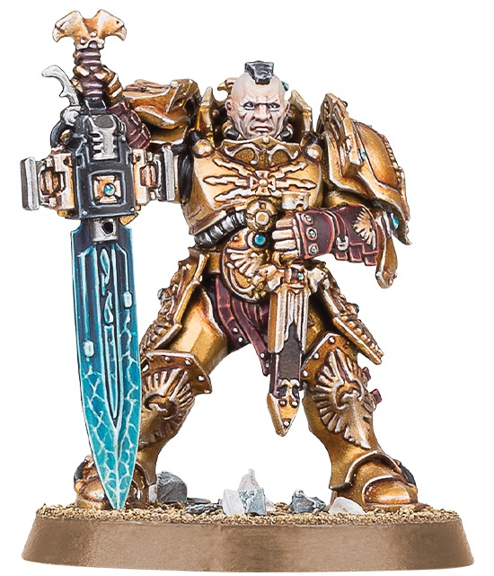

# Faces

## Introduction

헬멧 없는 Custodes 얼굴은 캐릭터성을 결정합니다. 피부는 면적이 작지만 시선이 먼저 가기 때문에 과도한 디테일보다는 깨끗한 명암과 눈 주변 정리가 중요합니다.

## Theory

얼굴은 따뜻한 중간톤, 붉은 그림자, 밝은 이마와 광대가 핵심입니다. Royal Navy 갑옷이 차갑기 때문에 피부는 자연스러운 따뜻함을 유지해야 합니다.

## Recommended Paints

| Stage | Paint | Purpose |
|---|---|---|
| Primer | Grey or Ivory spot | 피부 발색 |
| Base | Bugman's Glow | 피부 기준 |
| Layer | Cadian Fleshtone | 넓은 밝힘 |
| Shade | Reikland Fleshshade | 따뜻한 그림자 |
| Highlight | Kislev Flesh | 코, 광대, 이마 |
| Extreme Highlight | Pallid Wych Flesh | 작은 극점 |
| Varnish | Matte | 피부 자연감 |

## Alternative Paints

| 역할 | Vallejo | AK Interactive | Citadel | Army Painter | Two Thin Coats |
|---|---|---|---|---|---|
| Base Skin | Basic Skin Tone | Medium Flesh | Bugman's Glow | Tanned Flesh | Barbarian Brawn |
| Layer Skin | Flat Flesh | Light Flesh | Cadian Fleshtone | Barbarian Flesh | Dwarven Skin |
| Shade | Flesh Wash | Flesh Wash | Reikland Fleshshade | Flesh Wash | Flesh Wash |
| Highlight | Light Flesh | Pale Flesh | Kislev Flesh | Elven Flesh | Elven Skin |

## Recommended Tools

- 끝이 좋은 0호 브러시
- 확대경
- 글레이즈 미디엄
- Ivory 밑칠용 작은 브러시

## Difficulty

Intermediate. 면적이 작아 수정은 쉽지만, 과한 눈 표현은 모델을 어색하게 만들 수 있습니다.

## Time Required

| 대상 | 시간 |
|---|---|
| 일반 얼굴 | 30~60분 |
| 캐릭터 얼굴 | 1~2시간 |

## Step-by-Step Process

1. 얼굴만 Ivory 또는 Grey로 밑칠합니다.
2. Bugman's Glow를 얇게 2회 칠합니다.
3. Reikland Fleshshade를 눈, 코, 입 주변에만 넣습니다.
4. Cadian Fleshtone으로 이마, 코, 광대, 턱을 밝힙니다.
5. Kislev Flesh를 더 작은 면에 올립니다.
6. 눈은 흰 선보다 어두운 눈구멍과 작은 점으로 처리합니다.

## Painting Recipe

| Stage | Paint | Purpose |
|---|---|---|
| Primer | Ivory spot over Black | 피부 발색 |
| Base | Bugman's Glow | 기준 피부 |
| Layer | Cadian Fleshtone | 얼굴 볼륨 |
| Shade | Reikland Fleshshade | 따뜻한 깊이 |
| Highlight | Kislev Flesh | 주요 돌출부 |
| Extreme Highlight | Pallid Wych Flesh | 코끝, 광대 |
| Optional Weathering | Carroburg Crimson glaze | 상처와 홍조 |
| Optional Airbrush Method | 필요 없음 | 작은 영역 |
| Brush-only Method | 작은 면 레이어링 | 표준 방식 |
| Recommended Varnish | Matte Varnish | 자연스러운 피부 |

## Common Mistakes

- 눈 흰자를 크게 그려 놀란 표정이 되는 것
- 얼굴 전체에 워시를 과하게 발라 더러워지는 것
- 피부 하이라이트를 흰색으로 올려 생기가 사라지는 것

> ⚠ 작은 미니어처의 눈은 실제 눈처럼 그릴 필요가 없습니다. 어두운 눈구멍과 작은 밝은 점만으로 충분합니다.

## Professional Tips

💡 Pro Tip

피부가 갑옷보다 너무 어둡게 보이면 얼굴 주변 갑옷 하이라이트를 조금 낮추고 피부 이마와 코를 밝히세요.

💡 Pro Tip

캐릭터는 눈보다 눈썹뼈와 코의 명암이 더 중요합니다.

## Summary

얼굴은 작은 중심점입니다. 과한 디테일보다는 따뜻한 명암과 깨끗한 마감이 중요합니다.

## Checklist

- [ ] 얼굴에 밝은 밑칠을 넣었다.
- [ ] 쉐이드가 눈과 입 주변에만 남았다.
- [ ] 코, 이마, 광대가 읽힌다.
- [ ] 눈 표현이 과하지 않다.
- [ ] 무광으로 마감했다.

