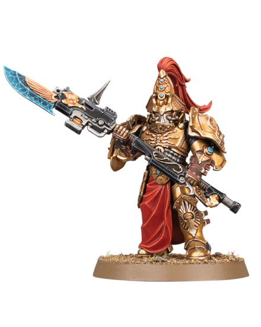

# Capes

## Introduction

망토는 캐릭터와 Wardens의 품질을 결정하는 큰 천 면입니다. 작은 천과 달리 넓은 그라데이션이 필요하며, 갑옷의 어두운 남색과 충돌하지 않는 깊은 붉은색을 권장합니다.

## Theory

큰 망토는 전체를 같은 밝기로 칠하면 평평합니다. 위쪽과 접힌 산은 밝게, 안쪽과 아래쪽은 어둡게 두면 자연스럽고 극적인 형태가 생깁니다.

## Recommended Paints

| Stage | Paint | Purpose |
|---|---|---|
| Primer | Black | 깊은 주름 |
| Base | Khorne Red | 어두운 붉은 천 |
| Layer | Wazdakka Red | 넓은 밝힘 |
| Shade | Nuln Oil + Lahmian Medium | 접힌 골 |
| Highlight | Squig Orange | 주름 끝 |
| Extreme Highlight | Kislev Flesh 소량 혼합 | 캐릭터 극점 |
| Varnish | Matte | 천 질감 |

## Alternative Paints

| 역할 | Vallejo | AK Interactive | Citadel | Army Painter | Two Thin Coats |
|---|---|---|---|---|---|
| Dark Red | Black Red | Deep Red | Khorne Red | Chaotic Red | Sanguine Scarlet |
| Mid Red | Scarlet | Deep Red Light | Wazdakka Red | Pure Red | Demon Red |
| Highlight | Orange Red | Orange Brown | Squig Orange | Lava Orange | Ember Orange |
| Shadow | Black Wash | Black Wash | Nuln Oil | Dark Tone | Oblivion Black Wash |

## Recommended Tools

- 2호 브러시
- 글레이즈 브러시
- 에어브러시
- 습식 팔레트
- 헤어드라이어 저온 모드

## Difficulty

Advanced for display, Intermediate for tabletop. 넓은 면을 얼룩 없이 부드럽게 연결하는 것이 핵심입니다.

## Time Required

| 대상 | 시간 |
|---|---|
| Warden 망토 | 1.5~3시간 |
| Blade Champion 망토 | 3~6시간 |

## Step-by-Step Process

1. Khorne Red를 전체에 얇게 올립니다.
2. 아래쪽과 안쪽은 Black Red 또는 Nuln Oil 글레이즈로 낮춥니다.
3. 주름 산을 따라 Wazdakka Red를 넓게 올립니다.
4. 경계를 Khorne Red 글레이즈로 부드럽게 통일합니다.
5. Squig Orange로 날카로운 주름 끝만 강조합니다.
6. 하단에는 Rhinox Hide 글레이즈를 아주 약하게 넣어 무게를 줍니다.

## Painting Recipe

| Stage | Paint | Purpose |
|---|---|---|
| Primer | Black | 깊이 |
| Base | Khorne Red | 기준 천색 |
| Layer | Wazdakka Red | 넓은 주름 |
| Shade | Nuln Oil + Lahmian Medium | 골과 하단 |
| Highlight | Squig Orange | 접힌 산 |
| Extreme Highlight | Squig Orange + Kislev Flesh | 캐릭터 포인트 |
| Optional Weathering | Rhinox Hide glaze at hem | 먼지와 사용감 |
| Optional Airbrush Method | Black Red, Khorne Red, Wazdakka Red zenithal | 부드러운 큰 면 |
| Brush-only Method | 얇은 글레이즈 4~6회 | 전시용 |
| Recommended Varnish | Matte Varnish | 천의 무광 |

## Common Mistakes

- 넓은 망토를 드라이브러시해 표면이 거칠어지는 것
- 주름 방향과 상관없이 같은 폭으로 하이라이트하는 것
- 하단 오염을 과하게 넣어 붉은 망토가 갈색으로 보이는 것

> ⚠ 망토는 넓은 면이라 붓자국이 잘 보입니다. 도료를 묽게 하고, 한 레이어가 완전히 마른 뒤 다음 레이어를 올리세요.

## Professional Tips

💡 Pro Tip

에어브러시가 있다면 망토는 가장 큰 시간 절약 부위입니다. 하지만 마지막 주름 선은 반드시 붓으로 정리해야 선명합니다.

💡 Pro Tip

[Wardens](../units/wardens.md)는 망토가 군대의 붉은 포인트를 가장 많이 보여주는 유닛입니다.

## Summary

망토는 Custodes의 품격을 높이는 큰 캔버스입니다. [Cloth](12-cloth.md)의 원칙을 확장하고, 더 부드러운 글레이즈로 마감하세요.

## Checklist

- [ ] 망토 위쪽과 아래쪽의 명도 차이가 있다.
- [ ] 주름 산만 밝게 올라갔다.
- [ ] 붓자국이 거칠지 않다.
- [ ] 하단 오염이 절제되어 있다.
- [ ] Matte 바니시로 마감했다.

