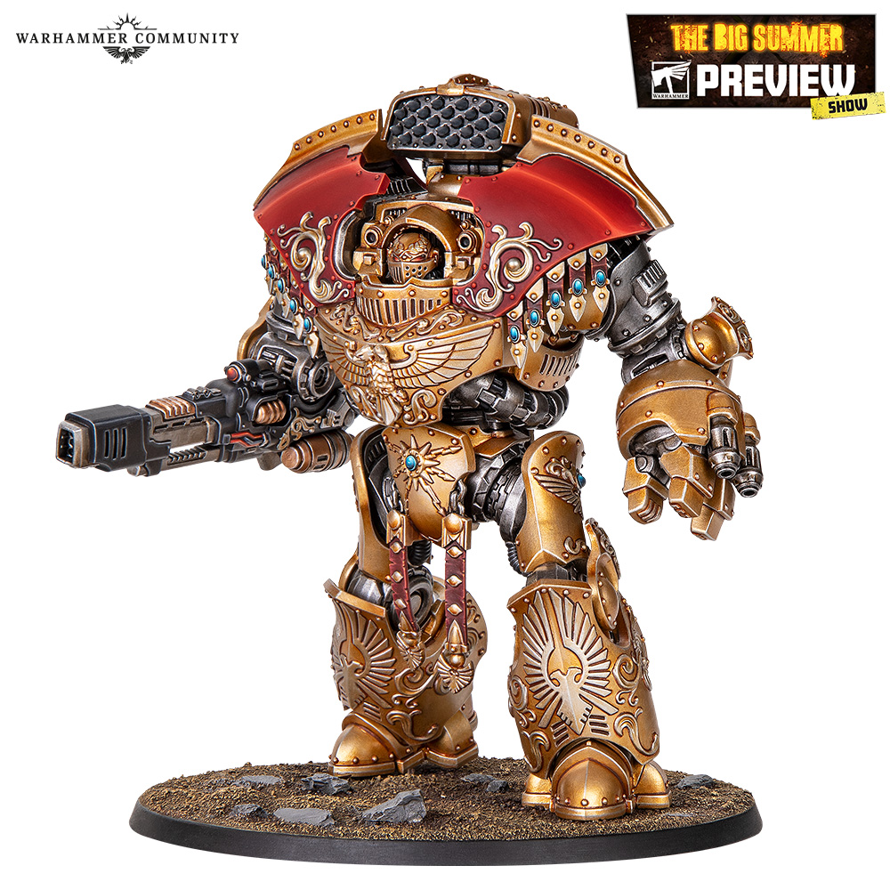

# Achillus Dreadnought

## Introduction

Achillus Dreadnought는 긴 spear와 전진하는 포즈가 강점입니다. 무기 끝과 상체를 가장 밝게 두면 공격적인 실루엣이 살아납니다.

## Theory

Achillus는 시선이 창끝으로 이동해야 합니다. 다리와 하단은 어둡고 무겁게, 상체와 창끝은 밝고 선명하게 처리합니다.

## Recommended Paints

| Stage | Paint | Purpose |
|---|---|---|
| Primer | Black | 깊이 |
| Base | Dark Prussian Blue | 갑옷 |
| Layer | Dark Sea Blue | 상체 |
| Shade | Drakenhof Nightshade | 홈 |
| Highlight | Prussian Blue | 긴 엣지 |
| Extreme Highlight | Fenrisian Grey, White Scar | 창끝 |
| Varnish | Ultra Matte + Satin | 재질 분리 |

## Alternative Paints

| 역할 | Vallejo | AK Interactive | Citadel | Army Painter | Two Thin Coats |
|---|---|---|---|---|---|
| Navy | Dark Prussian Blue | Deep Blue | Kantor Blue | Deep Blue | Night Sky |
| Energy | Blue Green | Turquoise | Sotek Green | Hydra Turquoise | Emerald Green |
| Gold | Metal Color Gold | Old Gold | Retributor Armour | Greedy Gold | Dragon's Gold |
| Steel | Metal Color Steel | Natural Steel | Leadbelcher | Gun Metal | Doom Death Black |

## Recommended Tools

- 에어브러시
- 1호 브러시
- 0호 브러시
- 스펀지
- 피닝 도구

## Difficulty

Advanced. 큰 몸체와 긴 무기를 함께 균형 잡아야 합니다.

## Time Required

12~22시간.

## Step-by-Step Process

1. spear는 휨을 확인하고 필요하면 보강합니다.
2. 갑옷은 상체 중심으로 [Armor Recipe](../armor/10-armor.md)를 강화합니다.
3. 금장은 [Gold](../armor/11-gold.md)를 사용하되 얼굴 주변 장식을 가장 밝게 둡니다.
4. spear blade는 [Energy](../armor/15-energy.md) 또는 [Weapons](../armor/14-weapons.md) 중 하나를 선택합니다.
5. 하단에는 제한적 웨더링을 넣어 전진감을 줍니다.

## Painting Recipe

| Stage | Paint | Purpose |
|---|---|---|
| Primer | Black | 깊이 |
| Base | Dark Prussian Blue | 주 색 |
| Layer | Dark Sea Blue | 상체 볼륨 |
| Shade | Drakenhof Nightshade, Agrax Earthshade | 홈 |
| Highlight | Prussian Blue, Liberator Gold | 엣지 |
| Extreme Highlight | White Scar, Stormhost Silver | 창끝과 얼굴 |
| Optional Weathering | Rhinox Hide, Leadbelcher | 발과 무릎 |
| Optional Airbrush Method | 상체 zenithal, 창날 OSL | 권장 |
| Brush-only Method | 패널별 레이어와 긴 엣지 | 가능 |
| Recommended Varnish | Ultra Matte, Satin, Gloss energy | 재질 구분 |

## Common Mistakes

- 창끝을 어둡게 남겨 포즈가 약해지는 것
- 하체와 상체를 같은 밝기로 칠해 움직임이 사라지는 것
- 웨더링을 창 전체에 넣어 에너지 효과가 탁해지는 것

> ⚠ Achillus의 주인공은 spear입니다. 무기 끝이 모델에서 가장 밝아야 합니다.

## Professional Tips

💡 Pro Tip

창날의 밝은 선은 완벽한 직선보다 방향성이 중요합니다. 끝으로 갈수록 밝아지게 설계하세요.

## Summary

Achillus는 공격적인 Dreadnought입니다. 상체와 창끝에 밝기를 집중해 포즈를 강화하세요.

## Checklist

- [ ] spear가 곧고 튼튼하다.
- [ ] 창끝이 가장 밝다.
- [ ] 하체는 무겁고 어둡다.
- [ ] 금장 핵심부가 선명하다.
- [ ] 웨더링이 하단에 집중되어 있다.

