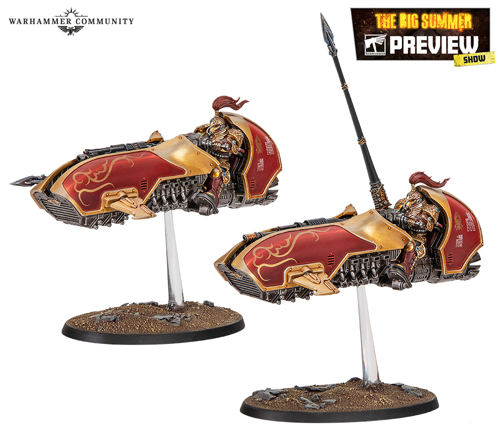

# Venatari

## Introduction

Venatari는 날개와 점프 장비 때문에 시각적으로 가볍고 빠른 유닛입니다. Royal Navy 스킴을 유지하되 하단 웨더링은 줄이고, 날개와 무기의 밝기를 높여 공중감을 만듭니다.

## Theory

공중 유닛은 위쪽과 바깥쪽을 밝게 칠하면 가벼워 보입니다. 발과 하단의 오염을 과하게 넣으면 비행감이 줄어듭니다.

## Recommended Paints

| Stage | Paint | Purpose |
|---|---|---|
| Primer | Black | 깊이 |
| Base | Dark Prussian Blue | 갑옷 |
| Layer | Dark Sea Blue | 상단 |
| Shade | Drakenhof Nightshade | 홈 |
| Highlight | Prussian Blue | 날개와 갑옷 엣지 |
| Extreme Highlight | Fenrisian Grey | 바깥쪽 날개 |
| Varnish | Ultra Matte + Satin | 질감 |

## Alternative Paints

| 역할 | Vallejo | AK Interactive | Citadel | Army Painter | Two Thin Coats |
|---|---|---|---|---|---|
| Navy | Dark Prussian Blue | Deep Blue | Kantor Blue | Deep Blue | Night Sky |
| Gold | Metal Color Gold | Old Gold | Retributor Armour | Greedy Gold | Dragon's Gold |
| Energy | Blue Green | Turquoise | Sotek Green | Hydra Turquoise | Emerald Green |
| Exhaust | Neutral Grey | Smoke Black | Eshin Grey | Ash Grey | Dungeon Stone |

## Recommended Tools

- 에어브러시
- 마스킹 테이프
- 0호 브러시
- 피닝용 황동봉

## Difficulty

Intermediate. 날개와 비행 스탠드 처리가 핵심입니다.

## Time Required

5~8시간 per model.

## Step-by-Step Process

1. 비행 스탠드와 모델 연결부를 보강합니다.
2. 갑옷은 [Armor Recipe](../armor/10-armor.md)를 따르되 날개 외곽 하이라이트를 조금 밝게 둡니다.
3. 금장은 [Gold](../armor/11-gold.md) 기준으로 얇게 처리합니다.
4. 무기 에너지는 [Energy](../armor/15-energy.md)로 선명하게 칠합니다.
5. 배기구는 Neutral Grey에서 Black으로 그을음을 작게 넣습니다.

## Painting Recipe

| Stage | Paint | Purpose |
|---|---|---|
| Primer | Black | 깊이 |
| Base | Dark Prussian Blue | 갑옷과 날개 |
| Layer | Dark Sea Blue | 상단과 외곽 |
| Shade | Drakenhof Nightshade | 홈 |
| Highlight | Prussian Blue | 날개 엣지 |
| Extreme Highlight | Fenrisian Grey | 바깥쪽 포인트 |
| Optional Weathering | Eshin Grey exhaust stain | 배기구 |
| Optional Airbrush Method | 날개 외곽 zenithal | 공중감 |
| Brush-only Method | 외곽 엣지를 일정하게 | 선명함 |
| Recommended Varnish | Ultra Matte, Satin gold | 가벼운 마감 |

## Common Mistakes

- 날개를 갑옷과 같은 밝기로 칠해 실루엣이 무거워지는 것
- 비행 스탠드 연결부를 약하게 조립하는 것
- 배기 그을음을 과하게 넣어 지저분해지는 것

> ⚠ Venatari의 웨더링은 절제하세요. 공중 유닛은 깨끗한 실루엣이 더 설득력 있습니다.

## Professional Tips

💡 Pro Tip

날개 외곽과 무기 끝을 밝히면 모델이 위로 떠오르는 느낌이 강해집니다.

## Summary

Venatari는 같은 팔레트 안에서 더 가볍고 빠르게 보이도록 조절하는 유닛입니다.

## Checklist

- [ ] 비행 스탠드가 튼튼하다.
- [ ] 날개 외곽 하이라이트가 갑옷보다 밝다.
- [ ] 배기 그을음이 작고 절제되어 있다.
- [ ] 무기 에너지가 선명하다.
- [ ] 전체 실루엣이 무겁지 않다.

