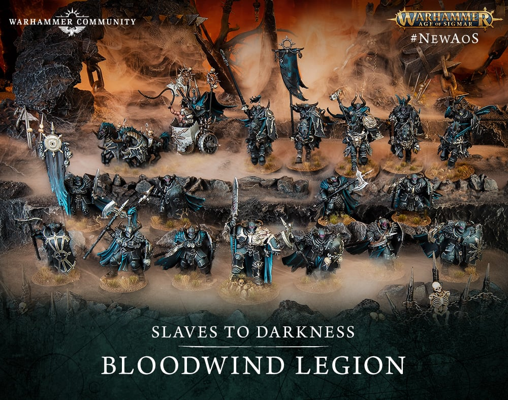

# 01 Introduction

## Introduction

Slaves to Darkness Spearhead는 초보자에게 매우 좋은 도색 박스입니다. 같은 검은 갑옷을 반복하면서도 `Chaos Lord`, `Chaos Warriors`, `Chaos Knights`가 각각 다른 크기와 질감을 보여주기 때문입니다. 이 책의 목표는 박스 안의 모델을 모두 같은 군대로 보이게 하면서, 각 유닛의 역할과 위압감을 살리는 것입니다.

이 가이드는 `Vallejo Game Color`를 기본 도료로 사용합니다. Vallejo는 무광에 가까운 마감, 부드러운 붓칠, 판타지 미니어처에 맞는 강한 색감을 제공하기 때문에 초보자가 색을 통제하기 쉽습니다. 대체 도료는 매 챕터마다 `Citadel`, `AK Interactive`, `Army Painter`, `Two Thin Coats`로 제공합니다.

## Painting goals

| 목표 | 설명 | 왜 중요한가 |
|---|---|---|
| 검은 갑옷을 검게 유지 | 갑옷은 어둡지만 모서리는 읽혀야 함 | Slaves to Darkness의 위압감 유지 |
| 청동 장식을 낡고 무겁게 표현 | 밝은 금보다 어두운 청동 사용 | 야만적이고 고대적인 분위기 |
| 강철 무기를 차갑게 분리 | 무기와 사슬은 갑옷보다 차가워야 함 | 전투적인 실루엣 강화 |
| 가죽, 털, 뿔을 낮은 채도로 처리 | 자연 재질은 조연으로 유지 | 모델이 산만해지지 않음 |
| 마커는 작은 금속과 장식에 제한 | trim, rivet, chain, symbol에 사용 | 빠르지만 표면 품질 유지 |

## Difficulty

Beginner to Advanced. 기본 과정은 초보자도 따라갈 수 있지만, 고급 단계에서는 검은 갑옷의 명도 설계, 청동 산화, 제한적 웨더링, 마커와 붓의 혼합 사용을 다룹니다.

## Estimated time

| 대상 | Tabletop 기준 | Display 기준 |
|---|---:|---:|
| Chaos Warrior 1명 | 3~5시간 | 6~10시간 |
| Chaos Warriors 전체 | 20~35시간 | 45시간 이상 |
| Chaos Knight 1기 | 6~10시간 | 12~20시간 |
| Chaos Lord | 8~15시간 | 20시간 이상 |

## Paint list

| 역할 | Vallejo Game Color 중심 Paint | 사용 이유 |
|---|---|---|
| Black Armor | Black, Charcoal, Neutral Grey | 검은 갑옷의 단계적 명도 |
| Bronze Trim | Tinny Tin, Brassy Brass, Bright Bronze | 낡은 청동의 따뜻한 금속감 |
| Steel | Dark Gunmetal, Chainmail, Silver | 무기와 사슬의 차가운 대비 |
| Cloth | Heavy Charcoal, Gory Red, Hexed Lichen | 어두운 악의 군세 분위기 |
| Leather | Charred Brown, Leather Brown, Bonewhite | 낮은 채도의 장비 |
| Fur | Beasty Brown, Khaki, Bonewhite | 야수적 질감 |
| Bone/Horn | Warm Grey, Bonewhite, White | 뿔과 해골 포인트 |
| Base | Charcoal, Neutral Grey, Earth | 어두운 황무지 |

## Alternative paints

| 역할 | Vallejo | Citadel | AK Interactive | Army Painter | Two Thin Coats |
|---|---|---|---|---|---|
| Black Armor | Black, Charcoal | Abaddon Black, Corvus Black | Black, Rubber Black | Matt Black, Deep Grey | Doom Death Black, Dungeon Stone |
| Bronze | Tinny Tin, Brassy Brass | Warplock Bronze, Balthasar Gold | Bronze, Old Bronze | Weapon Bronze, True Copper | Spartan Bronze, Dragon's Gold |
| Steel | Dark Gunmetal, Chainmail | Leadbelcher, Ironbreaker | Gun Metal, Natural Steel | Gun Metal, Shining Silver | Doom Death Black, Sir Coates Silver |
| Leather | Charred Brown, Leather Brown | Rhinox Hide, Mournfang Brown | Leather Brown, Saddle Brown | Oak Brown, Leather Brown | Cuirass Leather, Fur Cloak |
| Bone | Warm Grey, Bonewhite | Rakarth Flesh, Ushabti Bone | Warm Grey, Ivory | Skeleton Bone, Banshee Brown | Wasteland Brown, Dragon Fang |

## Tools

- 1호 라운드 브러시
- 0호 디테일 브러시
- 낡은 드라이브러시
- 습식 팔레트
- 검정 프라이머
- 마커용 테스트 카드
- AK Interactive Real Colors Markers 또는 AK Playmarkers
- 도색 손잡이

## Preparation

1. 모든 모델의 몰드라인을 제거합니다.
2. Chaos Knights는 말, 방패, 기수 장식을 서브어셈블리로 나눌지 확인합니다.
3. Chaos Lord는 망토와 방패 안쪽 접근성을 확인합니다.
4. Black primer를 기준으로 삼고, 피부와 뿔처럼 밝은 색이 필요한 부분은 나중에 부분 밑칠합니다.
5. 기준 모델은 Chaos Warrior 한 명으로 정합니다.

## Step-by-step workflow

1. [Armor Recipe](recipes/armor.md)로 검은 갑옷 기준을 만듭니다.
2. [Bronze Recipe](recipes/bronze.md)로 trim과 문양을 정리합니다.
3. [Steel Recipe](recipes/steel.md)로 무기, 사슬, 리벳을 차갑게 분리합니다.
4. [Leather Recipe](recipes/leather.md), [Fur Recipe](recipes/fur.md), [Horn Recipe](recipes/horn.md)를 작은 자연 재질에 적용합니다.
5. [Shield Recipe](recipes/shield.md)와 [Weapon Recipe](recipes/weapon.md)로 전면 시선점을 강화합니다.
6. [Base Recipe](recipes/base.md)로 전군 베이스를 통일합니다.
7. Matte varnish로 전체를 보호하고, 금속에는 필요 시 Satin을 선택 적용합니다.

## Spearhead core recipe

| Stage | Paint | Purpose |
|---|---|---|
| Primer | Vallejo Surface Primer Black | Spearhead 전체의 어두운 기준 |
| Basecoat | Black, Tinny Tin, Dark Gunmetal | 갑옷, 청동, 강철의 큰 재질 구분 |
| Layer | Charcoal, Brassy Brass, Chainmail | 검은 갑옷과 금속의 1차 명도 |
| Shade | Black Wash, Sepia Wash | 홈, trim 경계, 낡은 금속감 |
| Highlight | Neutral Grey, Bright Bronze, Silver | 모델이 테이블 위에서 읽히는 밝기 |
| Edge Highlight | Neutral Grey + Bonewhite, Silver | 얼굴 주변, 방패 상단, 무기 끝 극점 |
| Optional Drybrush | Khaki, Stonewall Grey | 털과 황무지 베이스 질감 |
| Optional Weathering | Charred Brown, Chipping Color | 발끝, 방패 하단, 무기 흠집 |
| Brush-only method | 얇은 basecoat 2회 후 edge 중심 | 초보자에게 가장 안정적인 방식 |
| Airbrush notes | Black primer 후 Charcoal을 위쪽 45도에서 얇게 | Knights와 Lord의 큰 갑옷 면에만 선택 |
| Recommended varnish | Vallejo Matt Varnish, metal Satin 선택 | 갑옷은 무겁게, 금속은 살아 있게 |

## Marker Tips

마커는 이 프로젝트에서 빠른 보조 도구로 사용합니다. 특히 trim, bronze trim, steel, chains, rivets, shields, symbols, horns의 초벌과 점 작업에 유용합니다.

| 추천 부위 | 추천 팁 크기 | 이유 |
|---|---|---|
| Armor trim | 0.7~1mm | 장식 선을 빠르게 따라가기 좋음 |
| Bronze trim | 0.7~1mm | 청동 베이스를 균일하게 넣기 좋음 |
| Steel rivets | 0.7mm | 작은 점 작업에 빠름 |
| Chains | 1mm | 사슬의 돌출부를 빠르게 잡음 |
| Shield symbols | 0.7~1mm | 양각 문양 초벌에 편함 |
| Horns | 0.7mm | 뿔 끝의 작은 단계 밑칠에 좋음 |

마커를 쓰지 말아야 할 곳도 분명합니다. Skin, faces, large cloth, fur, large smooth surfaces는 마커보다 붓이 좋습니다. 피부와 얼굴은 미세한 색 변화가 필요하고, 큰 천과 털은 방향성 있는 레이어가 필요하며, 넓고 매끈한 표면은 마커 스트로크가 남기 쉽습니다.

> ⚠ 마커는 모델 위에서 펌핑하지 마세요. 테스트 카드에서 잉크 흐름을 안정시킨 뒤 모델에 가져가야 과다 토출을 피할 수 있습니다.

## Professional tips

💡 Pro Tip

첫 Chaos Warrior는 실험 모델이 아니라 기준 모델입니다. 완성 후 앞, 뒤, 좌, 우 사진을 찍고 도료 희석 비율을 기록하세요. 이후 Chaos Knights와 Chaos Lord의 색 통일에 큰 도움이 됩니다.

💡 Pro Tip

검은 갑옷은 검정으로만 칠하면 사라집니다. `Charcoal`과 `Neutral Grey`를 아주 좁게 써서 모서리를 읽히게 만드는 것이 핵심입니다.

## Common mistakes

- 갑옷 전체를 회색으로 하이라이트해 검은 갑옷의 무게가 사라지는 것
- 모든 trim을 밝은 금색으로 칠해 Slaves to Darkness 특유의 어두운 분위기를 잃는 것
- 마커를 넓은 갑옷 면에 사용해 펜 자국이 남는 것
- 베이스를 너무 밝게 만들어 모델보다 시선을 빼앗는 것

## Troubleshooting

| 문제 | 원인 | 해결 |
|---|---|---|
| 갑옷이 검은 덩어리처럼 보임 | 엣지 명도 부족 | Neutral Grey를 아주 얇게 모서리에 추가 |
| 청동이 금색처럼 보임 | 하이라이트가 너무 밝음 | Sepia Wash 또는 Flesh Wash로 톤 낮춤 |
| 마커 자국이 번짐 | 잉크 과다 토출 | 완전 건조 후 베이스색으로 가장자리 정리 |
| 털이 납작함 | 드라이브러시 방향 부족 | 털 방향으로 Khaki를 가볍게 추가 |

## Summary

이 책의 기준은 어두운 철갑과 낡은 청동입니다. 마커는 시간을 줄여주는 도구지만, 최종 품질은 붓으로 정리한 명암과 엣지에서 나옵니다. 다음 장 [Color Concept](02-color-concept.md)에서는 이 색 조합이 왜 Spearhead 전체에 어울리는지 더 깊게 다룹니다.

## Checklist

- [ ] Chaos Warrior 기준 모델을 정했다.
- [ ] Black armor, bronze trim, steel weapon의 역할을 이해했다.
- [ ] 마커를 사용할 부위와 피할 부위를 구분했다.
- [ ] Vallejo Game Color 중심 팔레트를 준비했다.
- [ ] 첫 모델 완성 후 사진과 희석 비율을 기록할 준비를 했다.
