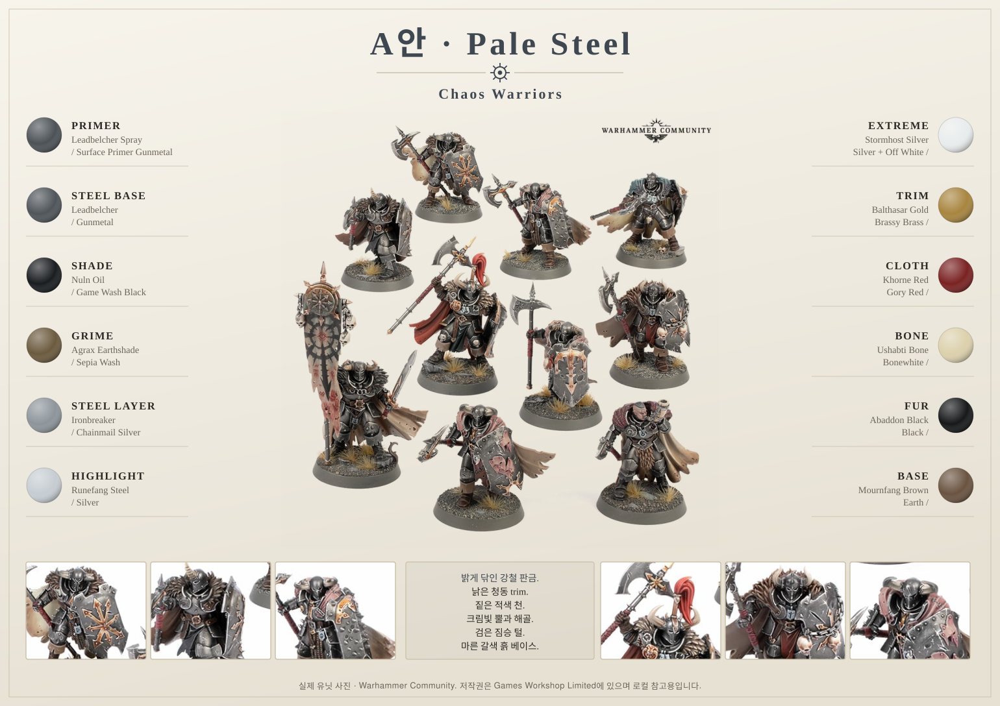
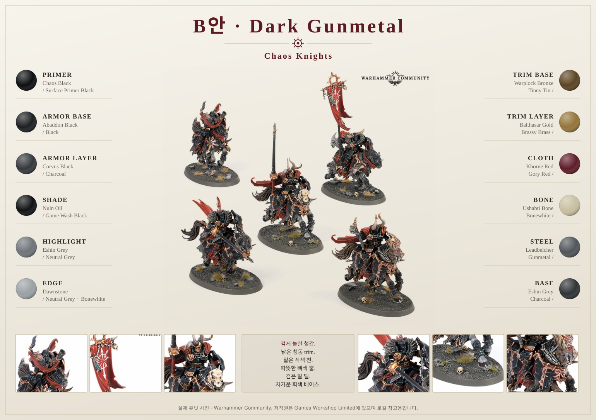
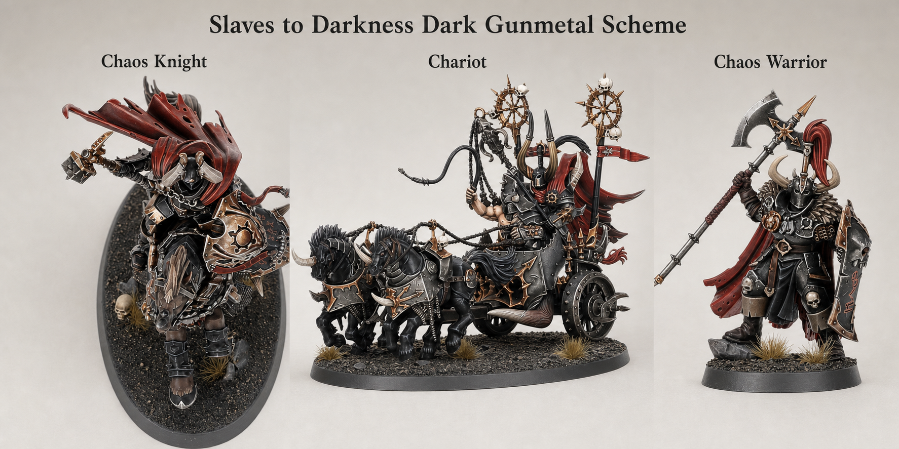

# 02 Color Concept

## Introduction

이 책의 컬러 콘셉트는 **Pale Steel**입니다. 검게 눌린 갑옷이 아니라, **오래 닦아 밝게 빛나지만 홈마다 때가 낀 강철 판금**이 중심입니다. Slaves to Darkness의 위압감은 어둠이 아니라 **금속의 무게와 대비**에서 나옵니다.

밝은 갑옷은 그 자체로는 완성되지 않습니다. 반드시 어두운 요소가 감싸야 합니다. 이 콘셉트에서는 **짙은 적색 천, 검은 짐승 털, 어두운 가죽, 갈색 흙 베이스**가 갑옷을 둘러싸는 액자 역할을 합니다. 갑옷만 밝고 나머지도 밝으면 모델이 뿌옇게 날아가고, 갑옷만 밝고 나머지가 어두우면 갑옷이 금속처럼 빛납니다.

| 요소 | 방향 |
|---|---|
| Pale Steel Armor | 밝게 닦인 강철 판금, 홈은 깊고 어둡게 |
| Warm Bone Horn | 따뜻한 크림색 뿔과 해골 |
| Deep Red Cloth | 채도를 낮춘 짙은 핏빛 천과 배너 |
| Black Fur | 거의 검은 짐승 털과 꼬리 |
| Aged Brass | 절제된 낡은 청동 trim |
| Dark Leather | 낮은 채도의 갈색 벨트와 끈 |
| Dry Earth Base | 마른 갈색 흙과 약간의 풀 |

> ⚠ 이전 판의 `Dark Gunmetal` 검은 갑옷 스킴은 [Dark Gunmetal 변형](#dark-gunmetal-변형)에 요약으로 남겨 두었습니다. 두 스킴을 한 부대에 섞지 마세요.

## Painting goals

| 색 영역 | 목표 | 왜 이 색인가 |
|---|---|---|
| Pale Steel Armor | 판금마다 상단이 밝고 홈이 깊게 | 갑옷이 주인공이 되는 스킴 |
| Deep Red Cloth | 어둡고 낮은 채도의 적색 | 은색의 유일한 색 포인트 |
| Warm Bone | 크림빛 뿔, 해골, 문양 | 차가운 은색에 온도를 더함 |
| Black Fur | 거의 검은 털 | 갑옷 밝기를 받쳐주는 어두운 액자 |
| Aged Brass | 소량의 따뜻한 금속 | 강철과 색온도를 분리 |
| Dry Earth Base | 갈색 흙 | 회색 베이스는 갑옷과 밝기가 겹침 |

## Difficulty

Beginner to Intermediate. 밝은 갑옷은 **칠하기는 쉽고 망치기도 쉽습니다.** 어렵게 만드는 것은 색이 아니라 홈을 얼마나 어둡게 유지하느냐입니다.

## Estimated time

| 작업 | 시간 |
|---|---:|
| 팔레트 카드 제작 | 1~2시간 |
| 기준 Chaos Warrior 테스트 | 3~5시간 |
| 전군 색 승인 | 1일 |

## Paint list

| 역할 | Vallejo Game Color | Purpose |
|---|---|---|
| Armor Base | Gunmetal | 판금 전체 바탕 |
| Armor Shade | Black Wash | 홈과 판 경계 |
| Armor Grime | Agrax + Seraphim Sepia 1:1 | **전면 원액.** 황동빛의 정체 |
| Armor Layer | Chainmail Silver | 판 중앙과 상단 면 |
| Armor Highlight | Silver | 모서리 |
| Armor Extreme | Silver + Off White | 헬멧과 어깨 최상단 |
| Cloth Shadow | Charred Brown | 천 주름 바닥 |
| Cloth Main | Gory Red | 배너와 천의 주색 |
| Cloth Highlight | Gory Red + Bonewhite | 주름 상단 |
| Bone | Khaki, Bonewhite, Off White | 뿔, 해골, 문양 |
| Fur | Black, Charcoal | 털과 꼬리 |
| Bronze | Tinny Tin, Brassy Brass | 절제된 trim |
| Base | Earth, Khaki | 마른 흙 |

## Alternative paints

| 역할 | Vallejo | Citadel | AK Interactive | Army Painter | Two Thin Coats |
|---|---|---|---|---|---|
| Steel Base | Gunmetal | Leadbelcher | Gun Metal | Gun Metal | Sir Coates Silver |
| Steel Layer | Chainmail Silver | Ironbreaker | Steel | Weapon Bronze Silver | Fenrisian Grey Steel |
| Steel Highlight | Silver | Runefang Steel | Bright Silver | Shining Silver | Rivet Silver |
| Black Wash | Game Wash Black | Nuln Oil | Black Wash | Dark Tone | Oblivion Black Wash |
| Grime Wash | Sepia Wash | Agrax Earthshade | Streaking Grime | Strong Tone | Battle Grime |
| Red Cloth | Gory Red | Khorne Red | Deep Red | Chaotic Red | Sanguine Scarlet |
| Bone | Bonewhite | Ushabti Bone | Ivory | Skeleton Bone | Dragon Fang |
| Bronze | Tinny Tin | Warplock Bronze | Old Bronze | Weapon Bronze | Spartan Bronze |

## Tools

- 색상 카드
- 금속 프라이머 테스트 카드
- 1호 브러시
- 0호 브러시
- 낡은 드라이브러시용 붓
- 스마트폰 카메라

## Preparation

1. 같은 금속색을 **Black primer**와 **Metal primer** 위에 각각 칠해 비교합니다.
2. Black Wash와 Sepia Wash를 각각 올린 카드를 나란히 두고 고릅니다.
3. 무광 바니시 후 금속 광택이 얼마나 죽는지 확인합니다.
4. 붉은 천 색을 3단계(그림자·주색·하이라이트)까지 카드로 만듭니다.

## Step-by-step workflow

1. 갑옷은 `Gunmetal`에서 시작해 **먼저 어둡게** 만든 뒤 밝은 면을 되살립니다.
2. `Agrax + Seraphim Sepia` 1:1을 **갑옷 전면에 원액**으로 올려 황동빛을 만들고, `Black Wash`는 홈과 판 경계에만 넣습니다.
3. `Chainmail Silver`를 판 중앙과 상단에 올려 갑옷 밝기를 결정합니다.
4. `Silver`는 모서리에만 긋고, 극점은 헬멧·어깨·무릎 정도로 제한합니다.
5. 천은 `Charred Brown → Gory Red → Gory Red + Bonewhite`로 어둡고 낮은 채도를 유지합니다.
6. 털, 가죽, 베이스를 어둡게 두어 갑옷을 감쌉니다.

## Core color recipe

| Stage | Paint | Purpose |
|---|---|---|
| Primer | Metal Primer (또는 Black + 은색 드라이브러시) | basecoat 생략 |
| Basecoat | Gunmetal | 표면 통일 |
| Shade | Black Wash | 홈과 판 경계 |
| Grime | Agrax + Seraphim Sepia 1:1 | 전면 원액 |
| Layer | Chainmail Silver | 판 중앙과 상단 |
| Highlight | Silver | 모서리 |
| Edge Highlight | Silver + Off White | 헬멧, 어깨 |
| Optional Drybrush | Chainmail Silver 매우 가볍게 | 사슬과 요철 |
| Optional Weathering | Charred Brown, Chipping Color | 하단 칩 |
| Brush-only method | 얇은 레이어와 엣지 중심 | 가장 안정적 |
| Airbrush notes | Black Wash 대신 묽은 Black을 아래 45도에서 | 큰 면 명암 |
| Recommended varnish | Satin 금속, Matt 천/털 | 재질 분리 |

## 대비 설계

밝은 갑옷 스킴에서 가장 중요한 규칙입니다.

| 부위 | 밝기 | 이유 |
|---|---:|---|
| 갑옷 판 상단 | 가장 밝게 | 시선이 먼저 가는 곳 |
| 갑옷 홈과 판 경계 | 가장 어둡게 | 형태를 읽히게 하는 선 |
| 천과 배너 | 중간~어둡게 | 유일한 색 포인트 |
| 털과 꼬리 | 어둡게 | 갑옷을 감싸는 액자 |
| 베이스 | 중간 갈색 | 은색과 밝기가 겹치지 않게 |

💡 Pro Tip  
갑옷을 사진으로 찍어 흑백으로 바꿔 보세요. **은색 갑옷과 베이스의 밝기가 비슷하면** 모델이 바닥에 녹아 붙어 보입니다. 그럴 때는 베이스를 어둡게 낮추는 편이 갑옷을 더 밝히는 것보다 안전합니다.

## Marker Tips

| 색 역할 | 마커 사용 | 이유 |
|---|---|---|
| Rivets | 강력 추천 | 반복되는 금속 점 작업 |
| Bronze trim | 권장 | 양각 장식을 빠르게 따라감 |
| Chains | 권장 | 사슬 돌출부 초벌 |
| Horn bands | 제한적 권장 | 뿔 밑칠 |
| 넓은 갑옷 판 | 비추천 | 밝은 금속에서 스트로크가 그대로 보임 |
| Large cloth | 비추천 | 펜 자국과 경계 |
| Fur | 비추천 | 털 방향과 건식 질감이 필요 |

> ⚠ Pale Steel에서는 마커 자국이 이전보다 **더 잘 보입니다.** 검은 갑옷은 자국을 숨겨 주지만, 밝은 금속은 광택 차이까지 드러냅니다.

## Professional tips

💡 Pro Tip

밝은 갑옷의 완성도는 하이라이트가 아니라 **홈의 깊이**로 결정됩니다. `Silver`를 더 올리기 전에 `Black Wash`가 판 경계에 제대로 들어갔는지 먼저 확인하세요.

💡 Pro Tip

이 스킴의 황동빛은 금색 도료가 아니라 **은색 위에 두껍게 올린 세피아**에서 나옵니다. 색 파츠가 거의 없는데도 전체가 따뜻하게 보이는 이유입니다.

💡 Pro Tip

붉은 천은 선명할수록 좋아 보이지만, 은색 옆에서는 쉽게 튑니다. **채도를 한 단계 낮춘 어두운 적색**이 갑옷을 이기지 않습니다.

## Common mistakes

- 갑옷을 밝게 만들면서 홈까지 밝아져 형태가 사라지는 것
- 무기와 갑옷을 같은 밝기로 칠해 재질이 구분되지 않는 것
- 베이스를 회색으로 두어 갑옷과 밝기가 겹치는 것
- 붉은 천을 선명한 빨강으로 칠해 갑옷보다 먼저 보이는 것
- 무광 바니시를 전체에 뿌려 금속 광택을 모두 죽이는 것

## Troubleshooting

| 문제 | 원인 | 해결 |
|---|---|---|
| 모델이 뿌옇다 | 어두운 요소 부족 | 털, 가죽, 베이스를 낮춤 |
| 갑옷이 밋밋하다 | 홈이 얕음 | `Black Wash`를 판 경계에 재작업 |
| 은색이 회색 같다 | 광택 부족 | Satin 바니시를 금속에만 적용 |
| 금속이 너무 누렇다 | Sepia 과다 | `Chainmail Silver`로 판 중앙만 되살림 |
| 은색이 차갑고 밋밋하다 | Sepia 부족 | Agrax + Sepia 1:1 전면에 한 번 더 |
| 천이 튄다 | 채도 과다 | `Charred Brown` 글레이즈로 낮춤 |

## Dark Gunmetal 변형

검게 눌린 갑옷을 원한다면 아래 순서로 바꾸면 됩니다. 나머지 부위(청동, 뼈, 가죽, 털)는 그대로 사용할 수 있습니다.

| Stage | Paint |
|---|---|
| Primer | Black Primer |
| Basecoat | Black |
| Layer | Charcoal |
| Shade | Black Wash |
| Highlight | Neutral Grey |
| Edge Highlight | Neutral Grey + Bonewhite |

> ⚠ 이 변형은 **작업 방향이 반대**입니다. Pale Steel은 밝은 상태에서 어둡게 눌러 내려가고, Dark Gunmetal은 어두운 상태에서 밝혀 올라갑니다.

## Summary

Pale Steel의 핵심은 밝은 갑옷이 아니라 **밝은 갑옷과 어두운 액자의 대비**입니다. 실제 부위별 적용은 [Armor Recipe](recipes/armor.md), [Steel Recipe](recipes/steel.md), [Cloth Recipe](recipes/cloth.md)를 기준으로 진행하세요.

## Checklist

- [ ] Gunmetal, Chainmail Silver, Silver의 역할을 구분했다.
- [ ] Black Wash와 Sepia Wash의 사용처를 나눴다.
- [ ] 붉은 천 색을 채도 낮은 어두운 적색으로 정했다.
- [ ] 털, 가죽, 베이스를 갑옷보다 어둡게 두기로 했다.
- [ ] 흑백 사진으로 밝기 대비를 확인했다.
