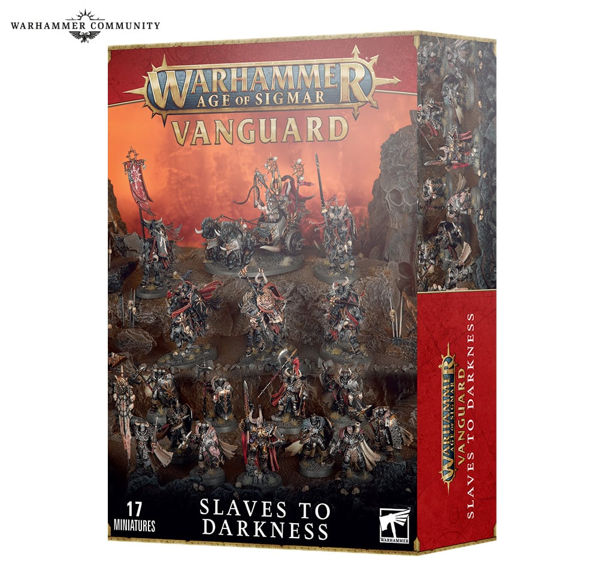

# Age of Sigmar Slaves to Darkness Spearhead Paint Guide

이 책은 Age of Sigmar `Slaves to Darkness Spearhead` 박스를 처음부터 끝까지 칠하기 위한 한국어 페인팅 가이드입니다. 기본 도료 체계는 `Vallejo Game Color`를 중심으로 구성하고, 각 레시피마다 `Citadel`, `AK Interactive`, `Army Painter`, `Two Thin Coats` 대체 도료를 함께 제공합니다.

Slaves to Darkness는 검은 철갑, 차가운 강철, 낡은 청동, 거친 가죽, 무거운 천, 짐승 털, 뿔, 어두운 베이스가 함께 어울려야 하는 군대입니다. 이 가이드는 초보자가 Spearhead 박스 전체를 완성할 수 있도록 순서를 세밀하게 나누고, 숙련자를 위해 글레이즈, 선택적 마커 작업, 제한적 웨더링, 광택 분리까지 다룹니다.

## Image Notice

이 프로젝트의 이미지는 Warhammer Community의 공개 이미지를 로컬 참고용으로 저장한 것입니다. 저작권은 Games Workshop Limited에 있으며, 공개 배포나 상업적 사용을 준비할 때는 직접 촬영 이미지, 라이선스 이미지, 또는 명시적 허가를 받은 이미지로 교체하세요. 출처는 [images/SOURCES.txt](images/SOURCES.txt)에 기록했습니다.

## How to Use

- 처음이라면 [Introduction](01-introduction.md), [Color Concept](02-color-concept.md), [Workflow](07-workflow.md)를 먼저 읽으세요.
- 준비물은 [Tools](03-tools.md), [Paints](04-paints.md), [Brushes](05-brushes.md), [Primer](06-primer.md)를 체크리스트처럼 사용하세요.
- 실제 도색은 `recipes/`의 공통 부위 레시피를 먼저 익힌 뒤 `units/`의 유닛별 순서를 따라가면 됩니다.
- 마커는 이 프로젝트의 공식 보조 도구입니다. 단, 얼굴, 피부, 큰 천, 털, 넓은 매끈한 갑옷 면에는 권장하지 않습니다.
- 한 번에 전군을 완성하려 하지 말고 `Chaos Warrior` 한 명을 기준 모델로 먼저 완성하세요.

## Complete Table of Contents

- [01 Introduction](01-introduction.md)
- [02 Color Concept](02-color-concept.md)
- [03 Tools](03-tools.md)
- [04 Paints](04-paints.md)
- [05 Brushes](05-brushes.md)
- [06 Primer](06-primer.md)
- [07 Workflow](07-workflow.md)

## Recipes

- [Armor](recipes/armor.md)
- [Bronze](recipes/bronze.md)
- [Steel](recipes/steel.md)
- [Cloth](recipes/cloth.md)
- [Leather](recipes/leather.md)
- [Fur](recipes/fur.md)
- [Horn](recipes/horn.md)
- [Wood](recipes/wood.md)
- [Weapon](recipes/weapon.md)
- [Shield](recipes/shield.md)
- [Base](recipes/base.md)

## Units

- [Chaos Lord](units/chaos-lord.md)
- [Chaos Warriors](units/chaos-warriors.md)
- [Chaos Knights](units/chaos-knights.md)

## Appendix

- [Shopping List](appendix/shopping-list.md)
- [Paint Alternatives](appendix/paint-alternatives.md)
- [Common Mistakes](appendix/common-mistakes.md)
- [FAQ](appendix/faq.md)
