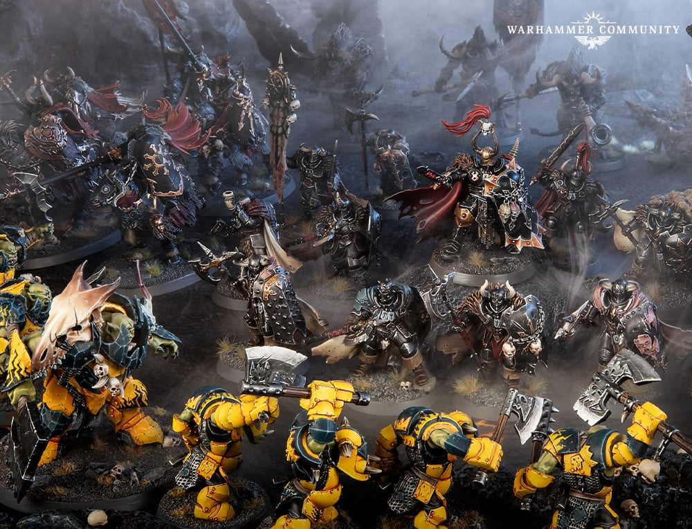

# Base

## Introduction

Base는 모델을 전장에 고정합니다. **Pale Steel** 스킴에는 회색 베이스가 어울리지 않습니다. 은색 갑옷과 밝기가 겹쳐 모델이 바닥에 녹아 붙어 보이기 때문입니다. 이 장은 **마른 갈색 흙**을 기준으로 합니다. 갈색은 은색과 색상·밝기가 모두 달라서 모델을 가장 확실하게 띄워 줍니다.

## Painting goals

| 목표 | 설명 |
|---|---|
| 마른 갈색 흙 | 은색 갑옷과 밝기·색상 분리 |
| 모델과 분리 | 갈색 계열로 발과 베이스 구분 |
| 빠른 반복 | 드라이브러시 중심 |
| 제한적 웨더링 | 발 주변 먼지와 흙 |
| 마커 제한 활용 | 베이스 림과 작은 파편 |

## Difficulty

Beginner. 드라이브러시와 wash만으로 충분히 좋은 결과를 만들 수 있습니다.

## Estimated time

| 대상 | 시간 |
|---|---:|
| 32mm base | 15~30분 |
| Knight base | 45~90분 |
| Spearhead 전체 | 4~8시간 |

## Paint list

| Stage | Vallejo Game Color | Purpose |
|---|---|---|
| Primer | Black Primer | 깊은 바닥 |
| Basecoat | Earth | 마른 갈색 흙 |
| Layer | Khaki | 질감 밝힘 |
| Shade | Black Wash | 틈 |
| Highlight | Bonewhite mix | 돌 모서리 |
| Edge Highlight | Bonewhite 소량 | 높은 자갈 |
| Optional Weathering | Earth pigment, Charred Brown | 먼지와 흙 |
| Recommended varnish | Matt Varnish | 건조한 표면 |

## Alternative paints

| 역할 | Vallejo | Citadel | AK Interactive | Army Painter | Two Thin Coats |
|---|---|---|---|---|---|
| Dark Ground | Earth | Mournfang Brown | Earth | Leather Brown | Fur Cloak |
| Mid Earth | Khaki | Karak Stone | Light Earth | Skeleton Bone | Dragon Fang |
| Light Stone | Stonewall Grey | Administratum Grey | Light Grey | Ash Grey | Wizard Grey |
| Earth | Earth | Dryad Bark | Dark Earth | Oak Brown | Wasteland Brown |
| Pigment | Earth Pigment | 없음 | Dust Pigment | 없음 | 없음 |

## Tools

- 텍스처 페이스트
- 모래와 작은 코르크
- 낡은 드라이브러시
- 베이스 림용 Black marker 선택
- 피그먼트 픽서 선택
- Matt Varnish

## Preparation

1. 모델을 베이스에 붙이기 전 질감을 만들지, 붙인 뒤 만들지 결정합니다.
2. 발 주변에 텍스처가 너무 높게 쌓이지 않게 합니다.
3. 전군 베이스 림 색을 Black으로 통일합니다.
4. 마커를 림에 사용할 경우 완전 건조 후 만집니다.

## Step-by-step workflow

1. 텍스처 페이스트와 모래를 베이스에 얹습니다.
2. Black primer로 전체를 덮습니다.
3. Earth를 바닥 전체에 칠합니다.
4. Khaki를 드라이브러시해 질감을 살립니다.
5. Stonewall Grey를 더 가볍게 높은 부분에만 올립니다.
6. Black Wash를 큰 돌 사이에 넣습니다.
7. 발 주변에 Earth pigment를 아주 약하게 넣습니다.
8. 베이스 림은 Black으로 깔끔하게 정리합니다.

## Painting recipe

| Stage | Paint | Purpose |
|---|---|---|
| Primer | Black Primer | 깊은 바닥 |
| Basecoat | Earth | 마른 흙 기준 |
| Layer | Khaki | 질감 |
| Shade | Black Wash | 틈 |
| Highlight | Stonewall Grey | 돌 모서리 |
| Edge Highlight | Bonewhite mix | 높은 자갈 |
| Optional Drybrush | Khaki, Bonewhite | 빠른 베이스 |
| Optional Weathering | Earth pigment, Charred Brown | 발 주변 먼지 |
| Brush-only method | 드라이브러시 2단계 | 기본 |
| Airbrush notes | 큰 Knight base에 먼지 mist 가능 | 선택 |
| Recommended varnish | Matt Varnish | 건조한 지면 |

## Marker Tips

Base에서 마커는 보조 도구입니다.

| 작업 | 마커 사용 | 이유 |
|---|---|---|
| Base rim | 권장 | 빠르고 균일한 검정 림 |
| 작은 금속 파편 | 권장 | steel/bronze point |
| 돌 하이라이트 | 비추천 | 드라이브러시가 더 자연스러움 |
| 흙 면 전체 | 비추천 | 펜 자국과 광택 차이 |

> ⚠ 베이스 림을 마커로 칠한 직후 모델을 잡으면 지문과 광택 얼룩이 남을 수 있습니다. 완전히 마른 뒤 Matt Varnish로 정리하세요.

## Professional tips

💡 Pro Tip

베이스의 가장 밝은 색은 모델의 갑옷 edge보다 밝지 않게 조절하세요. 베이스가 너무 밝으면 시선이 아래로 떨어집니다.

💡 Pro Tip

Knights는 발굽 주변 먼지를 조금 더 넣으면 무게가 생깁니다. Warriors는 먼지를 적게 유지해야 작고 선명하게 보입니다.

## Common mistakes

- 베이스를 너무 밝게 칠해 모델보다 튀는 것
- 텍스처 페이스트를 발 위에 묻히는 것
- 피그먼트를 고정하지 않아 떨어지는 것
- 베이스 림을 지저분하게 남기는 것

## Troubleshooting

| 문제 | 원인 | 해결 |
|---|---|---|
| 모델 하단이 사라짐 | 베이스가 너무 어두움 | Khaki drybrush 추가 |
| 베이스가 튐 | highlight 과다 | Earth glaze로 낮춤 |
| 피그먼트가 떨어짐 | 고정 부족 | Pigment Fixer 또는 Matt Varnish |
| 림이 얼룩짐 | 마커 건조 부족 | 완전 건조 후 Black 재정리 |

## Summary

Base는 전군을 하나로 묶는 마지막 색입니다. 마른 갈색 흙으로 모델을 받치고, 약간의 풀 터프트와 발 주변 먼지로 전장감을 더하세요. 은색 갑옷 아래에는 **갈색이 회색보다 언제나 낫습니다.**

## Checklist

- [ ] 전군 베이스 테마를 통일했다.
- [ ] Earth와 Khaki로 질감을 만들었다.
- [ ] 베이스가 모델보다 튀지 않는다.
- [ ] 발 주변 먼지가 자연스럽다.
- [ ] 베이스 림을 Black으로 깔끔하게 정리했다.

