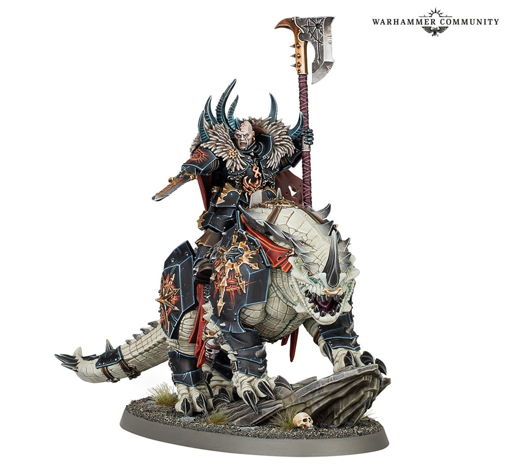

# Fur

## Introduction

Fur는 Slaves to Darkness 모델에 야만성과 추위를 더합니다. Warriors와 Lord의 장식, Knights의 장비 주변에서 작은 면으로 등장하지만, Pale Steel에서 검은 털은 밝은 갑옷을 감싸는 **어두운 액자** 역할까지 맡습니다. 털을 밝게 칠하지 마세요.

## Painting goals

| 목표 | 설명 |
|---|---|
| 방향성 있는 질감 | 털 결을 따라 밝힘 |
| 낮은 채도 | 갑옷과 trim을 방해하지 않음 |
| 자연스러운 밝기 | 끝으로 갈수록 밝아짐 |
| 마커 비추천 | 털 결 표현에는 붓이 우월 |

## Difficulty

Beginner to Intermediate. 드라이브러시는 쉽지만, 도료량이 많으면 털이 분필처럼 거칠어집니다.

## Estimated time

| 대상 | 시간 |
|---|---:|
| 작은 fur trim | 10~20분 |
| Chaos Lord fur | 45~90분 |
| Knight 장식 fur | 20~40분 |

## Paint list

| Stage | Vallejo Game Color | Purpose |
|---|---|---|
| Primer | Black Primer | 깊은 털 사이 |
| Basecoat | Charred Brown | 어두운 털 |
| Layer | Beasty Brown | 중간 질감 |
| Shade | Black Wash or Sepia Wash | 털 사이 깊이 |
| Highlight | Khaki | 털 끝 |
| Edge Highlight | Bonewhite | 가장 높은 끝 |
| Optional Drybrush | Khaki, Bonewhite | 빠른 질감 |
| Recommended varnish | Matt Varnish | 건조한 털 질감 |

## Alternative paints

| 역할 | Vallejo | Citadel | AK Interactive | Army Painter | Two Thin Coats |
|---|---|---|---|---|---|
| Dark Fur | Charred Brown | Rhinox Hide | Leather Brown Dark | Oak Brown | Cuirass Leather |
| Mid Fur | Beasty Brown | Mournfang Brown | Saddle Brown | Leather Brown | Fur Cloak |
| Light Fur | Khaki | Karak Stone | Tan | Banshee Brown | Griffon Claw |
| Pale Tip | Bonewhite | Ushabti Bone | Ivory | Skeleton Bone | Dragon Fang |
| Shade | Sepia Wash | Agrax Earthshade | Brown Wash | Strong Tone | Sepia Wash |

## Tools

- 낡은 드라이브러시
- 1호 브러시
- 0호 브러시
- 페이퍼 타월
- Matt Varnish

## Preparation

1. 털 방향을 눈으로 확인합니다.
2. 도료를 드라이브러시에 묻힌 뒤 페이퍼 타월에 거의 다 닦아냅니다.
3. 마커는 fur에 사용하지 않습니다.
4. 주변 갑옷과 trim이 완전히 마른 뒤 작업합니다.

## Step-by-step workflow

1. Charred Brown을 fur 전체에 칠합니다.
2. Sepia Wash 또는 Black Wash를 털 사이에 넣습니다.
3. Beasty Brown을 털 방향으로 가볍게 드라이브러시합니다.
4. Khaki를 더 적은 양으로 털 끝에 드라이브러시합니다.
5. 중요한 캐릭터는 0호 브러시로 Bonewhite 털 끝을 몇 가닥만 그립니다.
6. 너무 밝으면 Sepia glaze로 전체 톤을 낮춥니다.

## Painting recipe

| Stage | Paint | Purpose |
|---|---|---|
| Primer | Black Primer | 털 사이 그림자 |
| Basecoat | Charred Brown | 깊은 털 |
| Layer | Beasty Brown | 중간 털 |
| Shade | Sepia Wash | 따뜻한 깊이 |
| Highlight | Khaki | 털 끝 |
| Edge Highlight | Bonewhite | 높은 털 몇 가닥 |
| Optional Drybrush | Khaki then Bonewhite | 빠른 질감 |
| Optional Weathering | Earth pigment | 먼지 낀 털 |
| Brush-only method | 털 방향 선 레이어 | display용 |
| Airbrush notes | 비추천 | 질감 방향이 약해짐 |
| Recommended varnish | Matt Varnish | 털 질감 유지 |

## Marker Tips

Fur는 마커 비추천 부위입니다. 털은 한 방향으로 난 수많은 가는 선이 모여 보이는 질감이기 때문에, 마커의 둥근 팁과 일정한 잉크량은 자연스러운 털 결을 만들기 어렵습니다.

| 작업 | 마커 사용 | 이유 |
|---|---|---|
| Fur basecoat | 비추천 | 결이 막히고 면처럼 보임 |
| Fur highlight | 비추천 | 선이 굵고 일정함 |
| Fur 옆 금속 리벳 | 권장 | 털이 아니라 금속 장식 |
| Fur 하단 먼지 | 제한적 | 아주 작은 Chipping Color 점만 가능 |

> ⚠ 털을 마커로 칠하면 빠르게 덮이지만, 털이 가죽이나 천처럼 납작해질 수 있습니다.

## Professional tips

💡 Pro Tip

드라이브러시는 왕복으로 문지르지 말고 털이 난 방향으로 쓸어주세요. 방향이 맞으면 간단한 색도 훨씬 자연스럽습니다.

💡 Pro Tip

Chaos Lord의 fur는 Warriors보다 한 단계 더 밝게 칠하면 캐릭터성이 살아납니다.

## Common mistakes

- 도료를 충분히 닦지 않고 드라이브러시해 표면이 뭉치는 것
- 털 방향과 반대로 칠하는 것
- Bonewhite를 너무 넓게 써 흰 털처럼 보이는 것
- 마커로 fur base를 칠하는 것

## Troubleshooting

| 문제 | 원인 | 해결 |
|---|---|---|
| fur가 분필처럼 보임 | 드라이브러시 도료 과다 | Sepia glaze로 통일 |
| fur가 너무 어둡다 | highlight 부족 | Khaki drybrush 추가 |
| fur가 너무 밝다 | Bonewhite 과다 | Beasty Brown glaze |
| 질감이 없음 | 방향성 부족 | 0호로 털 선 몇 가닥 추가 |

## Summary

Fur는 붓과 드라이브러시가 가장 좋은 부위입니다. 마커는 주변 리벳이나 장식에는 빠르지만, 털 자체에는 사용하지 마세요.

## Checklist

- [ ] 털 방향을 확인했다.
- [ ] Charred Brown으로 깊은 바탕을 만들었다.
- [ ] 드라이브러시 도료를 충분히 닦았다.
- [ ] 마커를 fur 자체에 사용하지 않았다.
- [ ] Matt Varnish로 마감한다.

