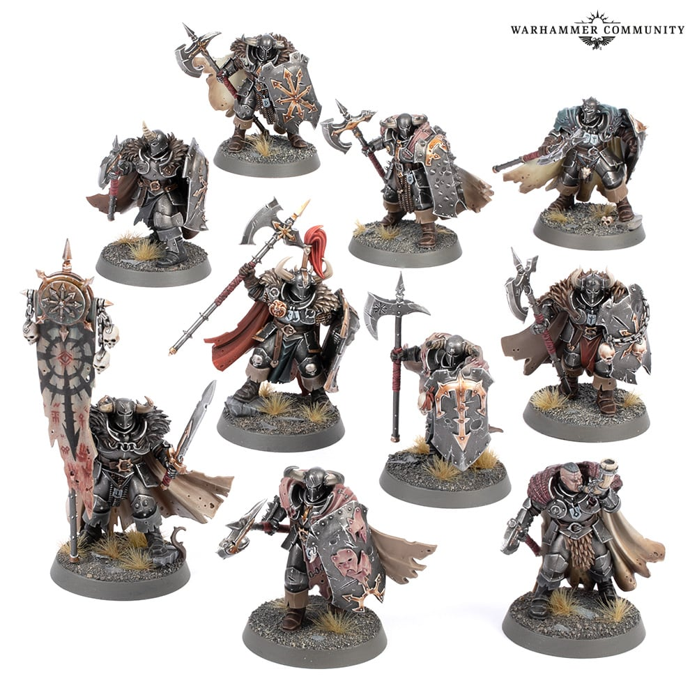

# Shield

## Introduction

Shield는 Chaos Warriors에서 가장 먼저 보이는 전면 부위입니다. 검은 방패판, 낡은 청동 trim, steel rivets, Chaos symbol이 한 면에 모이기 때문에 전체 스킴의 축소판이라고 볼 수 있습니다. 방패가 깨끗하면 분대 전체가 훨씬 정돈되어 보입니다.

## Painting goals

| 목표 | 설명 |
|---|---|
| 전면 가독성 | 방패 상단과 symbol이 읽혀야 함 |
| 갑옷과 통일 | Gunmetal 기준 유지 |
| trim 선명도 | Bronze가 방패 형태를 잡음 |
| 마커 활용 | symbol, rivets, scratches 초벌 |
| 제한적 손상 | 하단에만 battle damage |

## Difficulty

Intermediate. 넓은 방패 중앙은 매끈해야 하고, 작은 symbol은 정확해야 합니다.

## Estimated time

| 대상 | 시간 |
|---|---:|
| Warrior shield | 45~90분 |
| Command shield | 90~150분 |
| Lord shield | 2~4시간 |

## Paint list

| Stage | Vallejo Game Color | Purpose |
|---|---|---|
| Primer | Black Primer | 깊은 시작 |
| Basecoat | Black | 방패판 |
| Layer | Chainmail Silver | 상단 면 |
| Shade | Black Wash | 문양과 trim 경계 |
| Highlight | Silver | 방패 edge |
| Edge Highlight | Silver + Off White | 상단 극점 |
| Bronze | Tinny Tin, Brassy Brass | trim과 symbol |
| Steel | Gunmetal, Silver | rivets와 scratches |
| Recommended varnish | Matt shield, Satin metal | 재질 분리 |

## Alternative paints

| 역할 | Vallejo | Citadel | AK Interactive | Army Painter | Two Thin Coats |
|---|---|---|---|---|---|
| Shield Black | Black | Abaddon Black | Black | Matt Black | Doom Death Black |
| Shield Layer | Chainmail Silver | Ironbreaker | Steel | Plate Mail Metal | Fenrisian Grey Steel |
| Edge | Silver | Runefang Steel | Bright Silver | Shining Silver | Rivet Silver |
| Bronze Symbol | Brassy Brass | Balthasar Gold | Bronze | True Copper | Dragon's Gold |
| Steel Rivets | Gunmetal | Leadbelcher | Gun Metal | Gun Metal | Sir Coates Silver dark mix |

## Tools

- 1호 브러시
- 0호 브러시
- 0.7mm metal marker
- 0.7~1mm bronze marker
- Chipping Color marker 선택
- 습식 팔레트

## Preparation

1. 방패는 가능하면 손에 붙이기 전 칠하는 것이 편합니다.
2. 방패 중앙의 몰드라인과 게이트 자국을 완전히 제거합니다.
3. symbol이 양각인지 음각인지 확인합니다.
4. 마커는 symbol과 rivets에만 사용하고 방패판 전체에는 사용하지 않습니다.

## Step-by-step workflow

1. Black으로 방패판 전체를 칠합니다.
2. Chainmail Silver를 방패 상단과 중앙 볼륨에 얇게 올립니다.
3. Silver로 방패 외곽 edge를 정리합니다.
4. Tinny Tin으로 trim과 symbol을 칠합니다. 마커 초벌 가능.
5. Sepia Wash로 bronze 홈을 낮춥니다.
6. Brassy Brass와 Bright Bronze로 symbol 상단을 밝힙니다.
7. rivets는 Gunmetal 또는 metal marker로 찍고 Black Wash를 넣습니다.
8. 하단에 Chipping Color와 Gunmetal로 작은 손상을 추가합니다.

## Painting recipe

| Stage | Paint | Purpose |
|---|---|---|
| Primer | Black Primer | 방패 깊이 |
| Basecoat | Black, Tinny Tin | 방패판과 trim |
| Layer | Chainmail Silver, Brassy Brass | 형태 |
| Shade | Black Wash, Sepia Wash | 경계와 깊이 |
| Highlight | Silver, Bright Bronze | 전면 가독성 |
| Edge Highlight | Silver + Off White, Silver | 상단 극점 |
| Optional Drybrush | 비추천 | 방패판은 매끈해야 함 |
| Optional Weathering | Chipping Color, Gunmetal | 하단 손상 |
| Brush-only method | 방패판 붓 레이어, symbol 디테일 | 최고 품질 |
| Airbrush notes | 큰 방패에 Chainmail Silver 45도 가능 | 선택 |
| Recommended varnish | Matt shield, Satin trim | 재질 분리 |

## Marker Tips

Shield는 마커를 잘 쓰면 속도가 크게 오릅니다. 특히 양각 symbol과 rivets는 0.7mm 팁으로 빠르게 잡을 수 있습니다.

| 부위 | 마커 사용 | 이유 |
|---|---|---|
| Bronze symbol | 권장 | 양각 문양 초벌이 빠름 |
| Rivets | 강력 추천 | 반복 점 작업 |
| Steel scratches | 제한적 | 작은 손상점 |
| Shield rim | 권장 | 외곽 trim 초벌 |
| Large shield face | 비추천 | 매끈한 검은 면에 자국이 남음 |

> ⚠ 방패 중앙은 모델의 얼굴처럼 보이는 면입니다. 마커 스트로크가 남으면 전체 분대가 급하게 칠한 느낌이 됩니다.

## Professional tips

💡 Pro Tip

방패 손상은 하단과 외곽에 집중하세요. 중앙 symbol 위에 손상을 많이 넣으면 문양이 읽히지 않습니다.

💡 Pro Tip

방패 상단 edge를 Warriors 전체에서 같은 밝기로 맞추면 분대 사진에서 통일감이 강해집니다.

## Common mistakes

- 방패 중앙을 마커로 칠해 펜 자국이 남는 것
- symbol을 너무 밝게 칠해 갑옷보다 튀는 것
- 모든 방패에 손상을 같은 위치로 찍는 것
- rivet 점이 너무 커지는 것

## Troubleshooting

| 문제 | 원인 | 해결 |
|---|---|---|
| 방패가 평평함 | 상단 Chainmail Silver 부족 | 중앙 상단에 얇은 layer |
| symbol이 지저분함 | 마커 번짐 | 완전 건조 후 Black으로 경계 정리 |
| 손상이 과함 | 칩 반복 과다 | Gunmetal로 일부 덮기 |
| rivet이 큼 | 팁 크기 과다 | 방패색으로 주변 줄이기 |

## Summary

Shield는 작은 모델의 전면 품질을 결정합니다. 방패판은 붓으로 매끈하게, symbol과 rivets는 마커로 빠르게 초벌한 뒤 붓으로 완성하세요.

## Checklist

- [ ] 방패 중앙 표면을 정리했다.
- [ ] 방패판에는 마커를 쓰지 않았다.
- [ ] symbol과 rivets는 깔끔하게 분리됐다.
- [ ] 손상은 하단과 외곽에 집중했다.
- [ ] 방패판과 trim의 광택을 분리한다.

