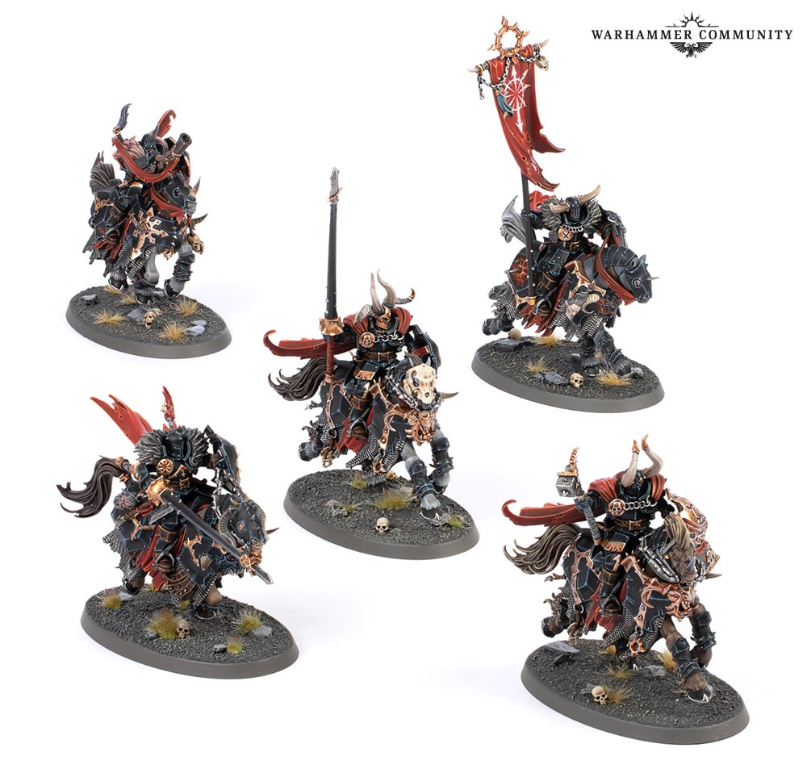

# Wood

## Introduction

Wood는 창대, 도끼 손잡이, 방패 내부 구조, 베이스 파편에 사용합니다. Slaves to Darkness의 wood는 밝은 새 목재가 아니라 기름과 피, 흙이 배어든 어두운 목재처럼 보여야 합니다. Leather와 비슷한 갈색을 쓰지만, wood는 더 길고 방향성 있는 결이 필요합니다.

## Painting goals

| 목표 | 설명 |
|---|---|
| 어두운 목재 | 갑옷과 자연스럽게 어울림 |
| 결 방향 | 긴 선으로 나무 재질 표현 |
| leather와 분리 | 더 회색/건조한 하이라이트 |
| 마커 제한 활용 | Wood Base 초벌 가능 |

## Difficulty

Beginner to Intermediate. 작은 선을 반복하면 어렵지 않지만, 결 방향을 무시하면 가죽처럼 보입니다.

## Estimated time

| 대상 | 시간 |
|---|---:|
| weapon haft | 15~30분 |
| shield back | 20~40분 |
| base debris | 10~20분 |

## Paint list

| Stage | Vallejo Game Color | Purpose |
|---|---|---|
| Primer | Black Primer | 깊은 틈 |
| Basecoat | Charred Brown | 어두운 목재 |
| Layer | Beasty Brown | 나뭇결 |
| Shade | Black Wash or Sepia Wash | 결 사이 |
| Highlight | Khaki | 마른 결 |
| Edge Highlight | Bonewhite 소량 | 쪼개진 끝 |
| Optional Weathering | Earth pigment | 오래된 먼지 |
| Recommended varnish | Matt Varnish | 건조한 목재 |

## Alternative paints

| 역할 | Vallejo | Citadel | AK Interactive | Army Painter | Two Thin Coats |
|---|---|---|---|---|---|
| Dark Wood | Charred Brown | Rhinox Hide | Leather Brown Dark | Oak Brown | Cuirass Leather |
| Mid Wood | Beasty Brown | Mournfang Brown | Saddle Brown | Leather Brown | Fur Cloak |
| Dry Edge | Khaki | Karak Stone | Tan | Banshee Brown | Griffon Claw |
| Pale Splinter | Bonewhite | Ushabti Bone | Ivory | Skeleton Bone | Dragon Fang |
| Shade | Black Wash | Nuln Oil | Black Wash | Dark Tone | Oblivion Black Wash |

## Tools

- 1호 브러시
- 0호 브러시
- Wood Base marker 선택
- 낡은 브러시
- 습식 팔레트

## Preparation

1. wood와 leather가 붙어 있는 부위를 구분합니다.
2. 나뭇결 방향을 길게 잡습니다.
3. 마커를 쓸 경우 넓은 방패 뒤쪽보다 창대 초벌에 사용합니다.
4. metal blade와 bronze trim이 완전히 마른 뒤 wood를 정리합니다.

## Step-by-step workflow

1. Charred Brown을 전체에 칠합니다.
2. Wood Base marker를 사용할 경우 창대 길이 방향으로 가볍게 초벌합니다.
3. Black Wash를 홈에 넣어 깊이를 만듭니다.
4. Beasty Brown으로 길고 끊어진 결을 그립니다.
5. Khaki로 더 적은 결과 쪼개진 끝을 밝힙니다.
6. Bonewhite는 부러진 날카로운 모서리에만 찍습니다.

## Painting recipe

| Stage | Paint | Purpose |
|---|---|---|
| Primer | Black Primer | 목재 틈 |
| Basecoat | Charred Brown | 어두운 바탕 |
| Layer | Beasty Brown | 결 |
| Shade | Black Wash | 깊이 |
| Highlight | Khaki | 마른 결 |
| Edge Highlight | Bonewhite | 쪼개진 끝 |
| Optional Drybrush | Khaki | 베이스 파편에만 |
| Optional Weathering | Earth pigment | 먼지 |
| Brush-only method | 길이 방향 결 선 | 권장 |
| Airbrush notes | 비추천 | 작은 선형 부위 |
| Recommended varnish | Matt Varnish | 건조한 재질 |

## Marker Tips

Wood는 마커를 제한적으로 사용할 수 있습니다. AK Real Colors Markers의 Wood Base 계열은 창대나 방패 내부 초벌에는 빠르지만, 최종 나뭇결은 붓으로 그려야 합니다.

| 부위 | 마커 사용 | 이유 |
|---|---|---|
| Weapon haft base | 권장 | 긴 면 초벌이 빠름 |
| Shield back base | 제한적 | 넓으면 자국이 남을 수 있음 |
| Wood grain | 비추천 | 선 굵기가 일정해 부자연스러움 |
| Broken splinter | 제한적 | 작은 밝은 점은 가능 |

> ⚠ 나뭇결은 완벽한 직선이 아닙니다. 마커로 한 줄을 길게 긋기보다 붓으로 끊긴 선을 겹치는 편이 자연스럽습니다.

## Professional tips

💡 Pro Tip

wood와 leather를 같은 색으로 칠했다면 wood에는 Khaki를, leather에는 Leather Brown을 더 많이 사용해 재질을 분리하세요.

💡 Pro Tip

창대는 손잡이 쪽보다 끝단과 모서리만 밝히면 충분합니다. 중앙을 너무 밝히면 무기 날보다 시선을 빼앗습니다.

## Common mistakes

- wood와 leather를 같은 방식으로 칠하는 것
- 나뭇결을 너무 규칙적으로 그리는 것
- 밝은 하이라이트가 넓어 새 목재처럼 보이는 것
- 마커 선을 그대로 결로 남기는 것

## Troubleshooting

| 문제 | 원인 | 해결 |
|---|---|---|
| wood가 leather처럼 보임 | 결 방향 부족 | Beasty Brown/Khaki 선 추가 |
| wood가 너무 밝다 | Khaki 과다 | Charred Brown glaze |
| 결이 인공적 | 선이 일정함 | 일부를 basecoat로 덮고 끊기 |
| 마커 자국이 보임 | 넓은 면 사용 | 붓 glaze로 통일 |

## Summary

Wood는 작은 보조 재질입니다. 마커는 초벌에만 쓰고, 최종 재질감은 방향성 있는 붓 선으로 만드세요.

## Checklist

- [ ] wood와 leather 색 역할을 구분했다.
- [ ] 결 방향을 길게 잡았다.
- [ ] 마커는 초벌에만 사용했다.
- [ ] Khaki 하이라이트가 과하지 않다.
- [ ] Matt Varnish로 마감한다.

