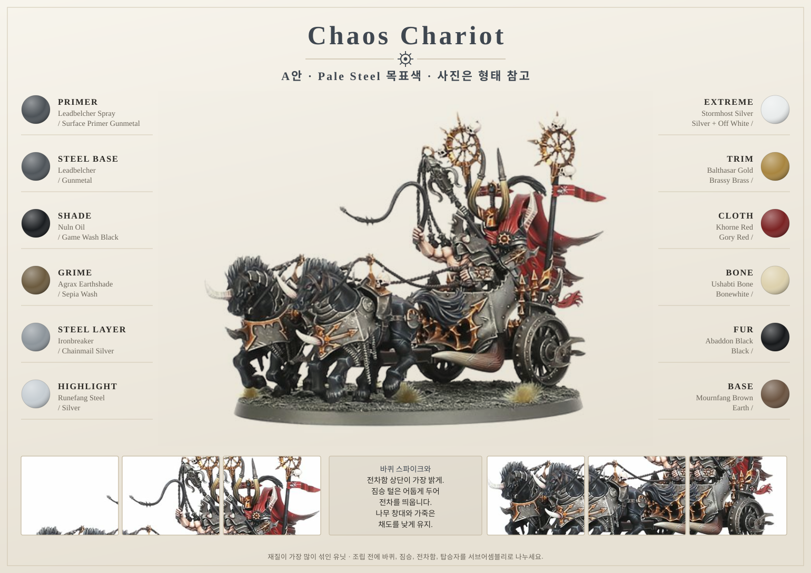
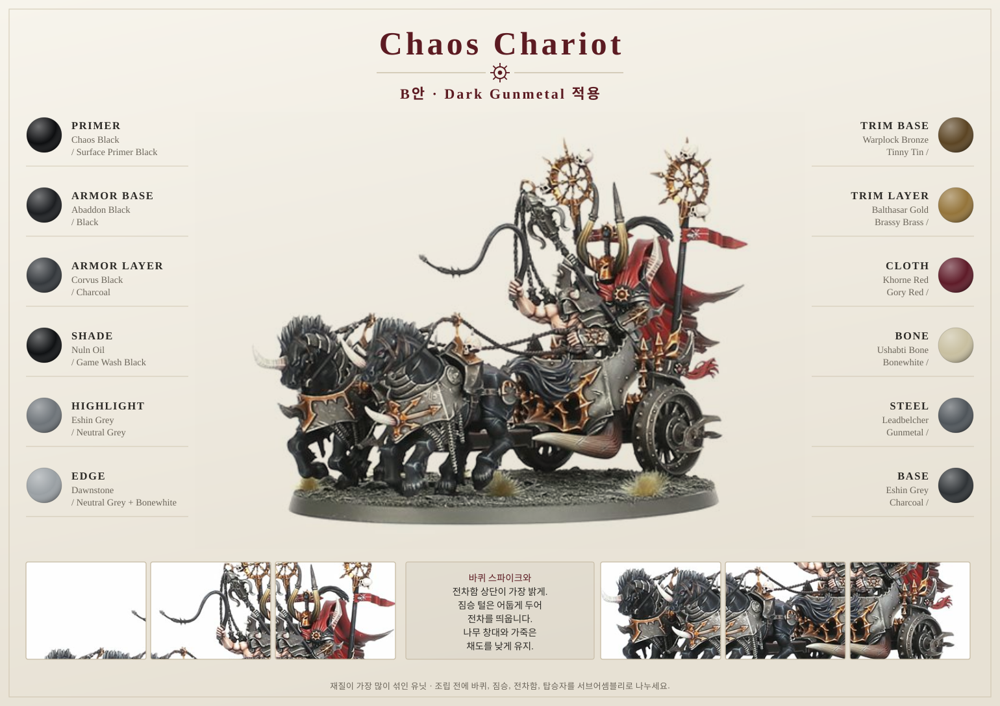

# Chaos Chariot

## Introduction

Chaos Chariot는 Spearhead 유닛 중 **재질이 가장 많이 섞인 모델**입니다. 강철 판금, 청동 장식, 나무 차대, 가죽 마구, 짐승 털, 뿔, 바퀴 스파이크가 한 모델에 모두 들어갑니다. 색을 새로 배우는 것이 아니라, **이미 정한 레시피를 순서대로 배치하는 연습**에 가깝습니다.

A안 [Pale Steel](../02-color-concept.md) 기준으로 설명하며, B안 Dark Gunmetal을 쓴다면 갑옷 3단계만 바꾸면 됩니다.

## Painting goals

| 목표 | 설명 |
|---|---|
| 속도감 | 바퀴 스파이크와 전차함 상단이 가장 밝게 |
| 재질 분리 | 금속 / 나무 / 가죽 / 털을 명확히 |
| 짐승 강조 | 견인 짐승이 전차보다 어둡게 |
| 접근성 관리 | 조립 순서를 미리 정할 것 |

## Difficulty

Advanced. 색은 어렵지 않지만 **조립 순서를 잘못 잡으면 붓이 들어가지 않습니다.**

## Estimated time

| 기준 | 시간 |
|---|---:|
| Tabletop 완성 | 6~10시간 |
| 웨더링 포함 | 12~16시간 |
| Display 수준 | 20시간 이상 |

## Paint list

| 영역 | Citadel | Vallejo |
|---|---|---|
| Armor / 금속 판 | Leadbelcher → Ironbreaker → Runefang Steel | Gunmetal → Chainmail Silver → Silver |
| Shade | Nuln Oil | Game Wash Black |
| Grime | Agrax Earthshade | Sepia Wash |
| Bronze Trim | Warplock Bronze → Balthasar Gold | Tinny Tin → Brassy Brass |
| Cloth / 배너 | Rhinox Hide → Khorne Red | Charred Brown → Gory Red |
| Wood | Rhinox Hide → Mournfang Brown → Karak Stone | Charred Brown → Beasty Brown → Khaki |
| Leather | Rhinox Hide → Mournfang Brown | Charred Brown → Leather Brown |
| Fur | Abaddon Black → Eshin Grey | Black → Charcoal |
| Horn / Bone | Zandri Dust → Ushabti Bone → Screaming Skull | Khaki → Bonewhite → Off White |
| Base | Mournfang Brown → Agrax → Karak Stone | Earth → Umber Wash → Khaki |

## Preparation

1. **바퀴, 견인 짐승, 전차함, 탑승자를 서브어셈블리로 나눕니다.** 조립 후에는 전차함 안쪽과 짐승 배 아래에 붓이 들어가지 않습니다.
2. 바퀴 스파이크는 프라이밍 전에 몰드라인을 정리합니다.
3. 견인대와 마구가 겹치는 순서를 미리 정합니다.
4. 배너가 있다면 따로 칠합니다.

## Step-by-step workflow

1. 전차함과 금속 판에 [Armor Recipe](../recipes/armor.md)를 적용합니다.
2. 바퀴 림과 스파이크는 [Steel Recipe](../recipes/steel.md)로 처리하고, 스파이크 끝만 `Silver`로 밝힙니다.
3. trim과 바퀴 허브는 [Bronze Recipe](../recipes/bronze.md)로 절제해서 칠합니다.
4. 차대와 창대는 [Wood Recipe](../recipes/wood.md), 마구는 [Leather Recipe](../recipes/leather.md)로 채도를 낮게 유지합니다.
5. 견인 짐승의 털은 [Fur Recipe](../recipes/fur.md)로 어둡게, 뿔은 [Horn Recipe](../recipes/horn.md)로 크림빛으로 마무리합니다.
6. 배너와 천은 [Cloth Recipe](../recipes/cloth.md)를 씁니다.
7. 베이스는 [Base Recipe](../recipes/base.md)를 쓰고 바퀴 자국과 발굽 주변 먼지를 더합니다.

## Marker Tips

| 부위 | 마커 사용 | 이유 |
|---|---|---|
| Rivets | 강력 추천 | 반복 점 작업 |
| 바퀴 스파이크 | 권장 | 개수가 많고 형태가 단순 |
| Chains | 권장 | 돌출부만 빠르게 |
| 전차함 큰 판 | 비추천 | 스트로크 자국 |
| 짐승 털 | 비추천 | 방향과 건식 질감이 필요 |

## Professional tips

💡 Pro Tip  
전차는 **위가 밝고 아래가 어둡다**는 규칙이 가장 잘 통하는 모델입니다. 바퀴 아래쪽과 차대 하단을 한 단계 어둡게 두면 무게가 생깁니다.

💡 Pro Tip  
견인 짐승을 전차보다 어둡게 두세요. 그래야 전차와 탑승자가 주인공으로 읽힙니다.

💡 Pro Tip  
바퀴 스파이크 끝의 `Silver` 점 몇 개가 이 모델에서 가장 효율이 좋은 하이라이트입니다.

## Common mistakes

- 조립 후에 칠하려다 전차함 안쪽에 붓이 들어가지 않는 것
- 스파이크를 전부 밝게 칠해 바퀴가 하얗게 뜨는 것
- 나무와 가죽의 채도가 높아 금속보다 먼저 보이는 것
- 짐승 털을 밝게 칠해 전차와 밝기가 겹치는 것

## Troubleshooting

| 문제 | 원인 | 해결 |
|---|---|---|
| 전차가 가벼워 보인다 | 하단이 밝음 | 차대 하단과 바퀴 아래를 어둡게 |
| 바퀴가 뭉쳐 보인다 | 스포크 사이 그림자 부족 | `Game Wash Black`을 스포크 사이에 |
| 짐승이 전차를 이긴다 | 털이 밝음 | `Black` 글레이즈로 낮춤 |
| 재질이 다 비슷하다 | 채도·밝기 차이 부족 | 나무는 낮은 채도, 금속은 광택으로 분리 |

## Checklist

- [ ] 바퀴, 짐승, 전차함, 탑승자를 서브어셈블리로 나눴다.
- [ ] 스파이크 하이라이트를 끝점에만 넣었다.
- [ ] 견인 짐승이 전차보다 어둡다.
- [ ] 나무와 가죽의 채도를 낮게 유지했다.
- [ ] 금속은 Satin, 천과 털은 Matt으로 분리했다.
