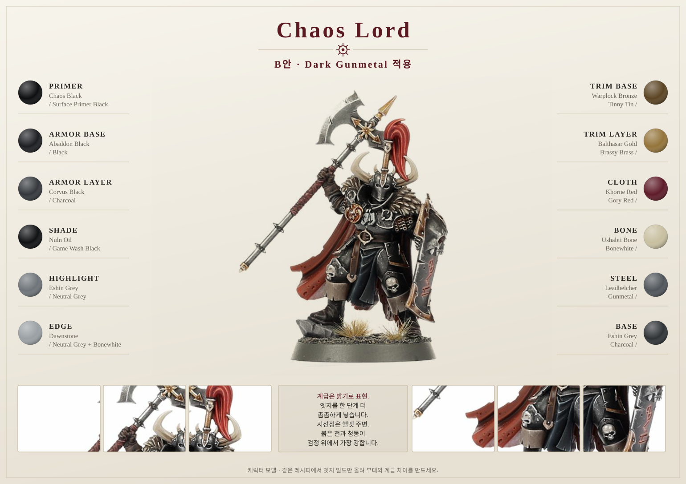
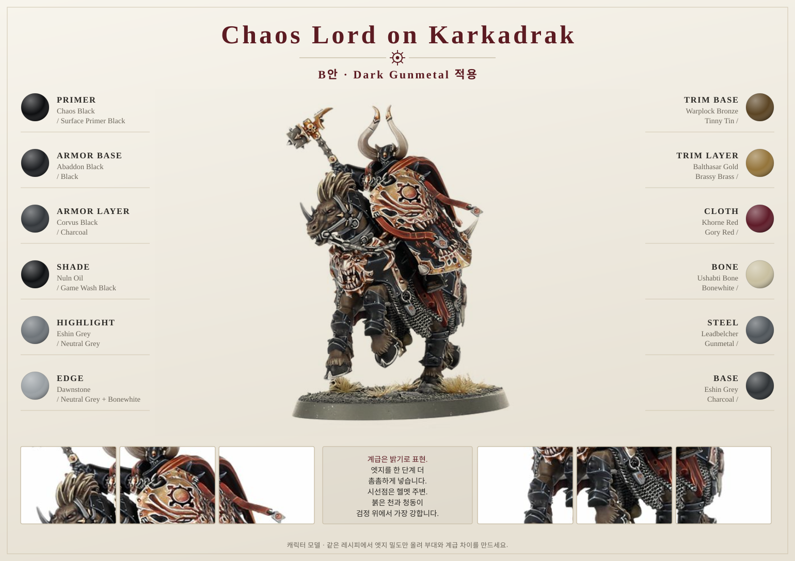
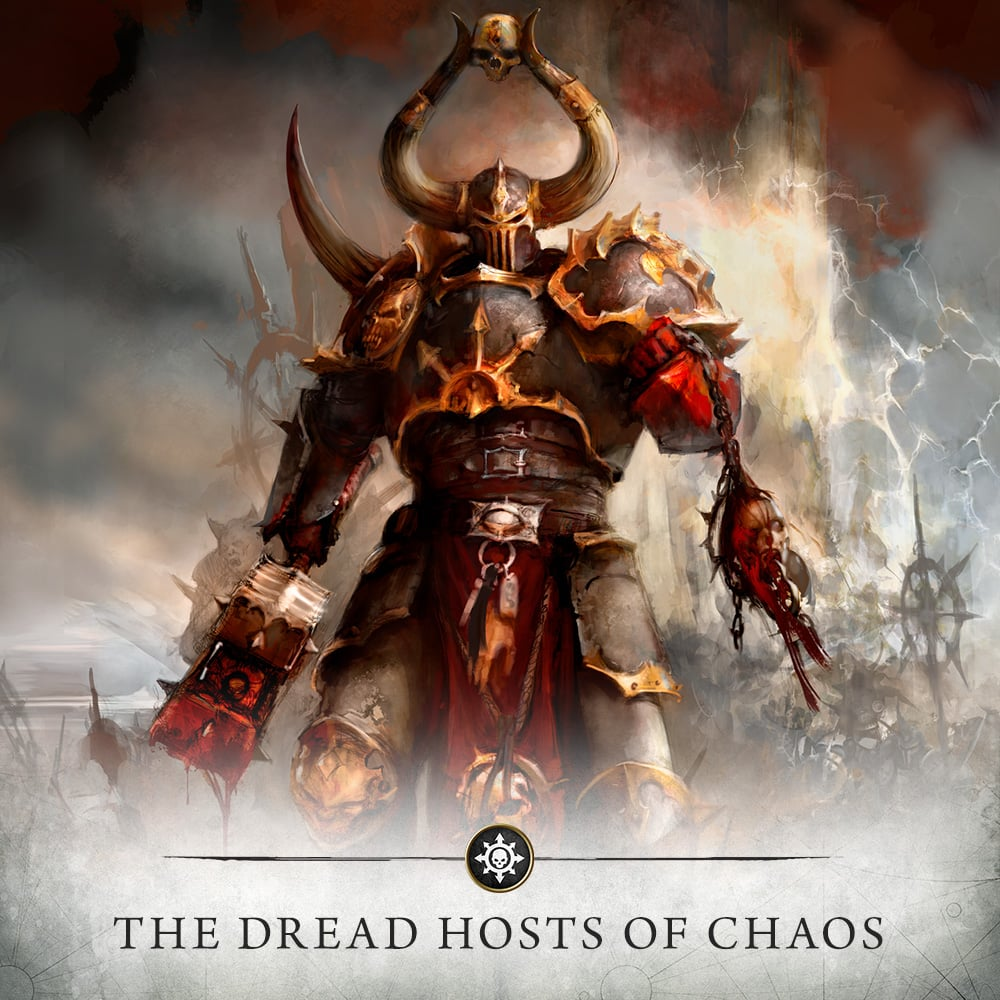

# Chaos Lord

## Introduction

Chaos Lord는 Spearhead의 시선 중심입니다. 같은 black armor와 bronze trim을 사용하되, Warriors보다 더 날카로운 edge highlight, 더 세밀한 weapon, 더 밝은 horn과 trophy를 적용해 지휘관처럼 보이게 합니다.

## Painting goals

| 목표 | 설명 |
|---|---|
| 전군 중심 | 가장 높은 명도와 세부 묘사 |
| 어두운 위압감 | 갑옷은 여전히 검게 유지 |
| 장식 강화 | bronze와 symbol을 Warriors보다 밝게 |
| 마커 제한 사용 | trim 초벌에는 가능, 얼굴/털/망토는 붓 |

## Difficulty

Advanced. 여러 재질이 밀집되어 있고, 너무 밝게 칠하면 전군 스킴에서 떠 보일 수 있습니다.

## Estimated time

| 기준 | 시간 |
|---|---:|
| Tabletop+ | 8~15시간 |
| Display | 20시간 이상 |

## Paint list

| 영역 | Vallejo Game Color |
|---|---|
| Armor | Gunmetal, Chainmail Silver, Silver |
| Bronze | Tinny Tin, Brassy Brass, Bright Bronze |
| Steel Weapon | Gunmetal, Chainmail Silver, Silver |
| Cloth | Gory Red or Hexed Lichen |
| Leather | Charred Brown, Leather Brown |
| Fur | Charred Brown, Beasty Brown, Khaki |
| Horn/Bone | Warm Grey, Bonewhite, White |
| Base | Earth, Khaki, Bonewhite |

## Alternative paints

| 역할 | Vallejo | Citadel | AK Interactive | Army Painter | Two Thin Coats |
|---|---|---|---|---|---|
| Armor | Gunmetal, Chainmail Silver | Leadbelcher, Ironbreaker | Gun Metal, Steel | Gun Metal, Plate Mail Metal | Sir Coates Silver |
| Bronze | Tinny Tin, Brassy Brass | Warplock Bronze, Balthasar Gold | Old Bronze, Bronze | Weapon Bronze, True Copper | Spartan Bronze |
| Steel | Gunmetal, Silver | Leadbelcher, Stormhost Silver | Gun Metal, Silver | Gun Metal, Shining Silver | Sir Coates Silver |
| Fur | Beasty Brown, Khaki | Mournfang Brown, Karak Stone | Saddle Brown, Tan | Leather Brown, Banshee Brown | Fur Cloak |
| Horn | Bonewhite | Ushabti Bone | Ivory | Skeleton Bone | Dragon Fang |

## Tools

- 1호 브러시
- 0호 브러시
- 금속 전용 브러시
- 0.7mm bronze/steel marker 선택
- 습식 팔레트
- 서브어셈블리 홀더

## Preparation

1. 망토, 방패, 무기, fur가 서로 가리는 부위를 확인합니다.
2. 가능한 경우 방패나 큰 장식은 분리해 칠합니다.
3. [Chaos Warriors](chaos-warriors.md) 기준 모델보다 한 단계 높은 하이라이트를 계획합니다.
4. 마커는 trim 초벌과 rivets에만 사용합니다.

## Step-by-step workflow

1. [Armor Recipe](../recipes/armor.md)로 갑옷을 칠하되 극점 하이라이트를 얼굴 주변에 집중합니다.
2. [Bronze Recipe](../recipes/bronze.md)로 trim을 칠하고 Bright Bronze를 Warriors보다 조금 더 사용합니다.
3. [Weapon Recipe](../recipes/weapon.md)로 무기를 가장 밝은 시선점 중 하나로 만듭니다.
4. [Cloth Recipe](../recipes/cloth.md)로 망토나 천을 어둡게 유지합니다.
5. [Fur Recipe](../recipes/fur.md)와 [Horn Recipe](../recipes/horn.md)를 적용해 자연 재질을 분리합니다.
6. [Base Recipe](../recipes/base.md)를 사용하되 바위 edge를 조금 더 정리해 캐릭터 베이스로 만듭니다.
7. 전체 Matt Varnish 후 metal은 Satin을 선택 적용합니다.

## Unit recipe

| Stage | Paint | Purpose |
|---|---|---|
| Primer | Black Primer, Off White spot on horns | 깊이와 밝은 부위 발색 |
| Basecoat | Gunmetal, Tinny Tin, Charred Brown | 주요 재질 |
| Layer | Chainmail Silver, Brassy Brass, Gory Red | 볼륨 |
| Shade | Black Wash, Sepia Wash | 재질별 깊이 |
| Highlight | Silver, Bright Bronze, Bonewhite | 캐릭터 선명도 |
| Edge Highlight | Silver + Off White | 헬멧 주변 극점 |
| Optional Drybrush | Khaki on fur/base | 질감 |
| Optional Weathering | Chipping Color, Earth pigment | 하단 사용감 |
| Brush-only method | 권장 | 캐릭터 품질 |
| Airbrush notes | 큰 망토/갑옷 상단에만 제한 | 선택 |
| Recommended varnish | Matt overall, Satin metal, Gloss gem 선택 | 재질 분리 |

## Marker Tips

Chaos Lord에는 마커를 적게, 정확히 씁니다.

| 부위 | 마커 사용 |
|---|---|
| Bronze trim 초벌 | 가능 |
| Steel rivets/chains | 권장 |
| Shield symbol 초벌 | 가능 |
| Horn tips | 제한적 가능 |
| Face/skin | 비추천 |
| Fur/large cloth | 비추천 |

> ⚠ 캐릭터 모델에서 마커 자국은 보병보다 더 잘 보입니다. 마커는 시간을 줄이는 단계로만 쓰고, 최종 경계와 하이라이트는 붓으로 마무리하세요.

## Professional tips

💡 Pro Tip

Chaos Lord의 가장 밝은 지점은 얼굴 주변, 무기 끝, 방패 symbol 중 두 곳만 선택하세요. 세 곳을 모두 같은 밝기로 만들면 시선이 분산됩니다.

💡 Pro Tip

Warriors보다 청동을 조금 더 밝게 칠하되, 갑옷 자체는 검게 유지해야 군대 중심으로 보입니다.

## Common mistakes

- Lord를 너무 화려하게 칠해 전군 팔레트와 분리되는 것
- fur와 망토를 마커로 칠해 질감이 납작해지는 것
- weapon보다 방패 손상이 더 눈에 띄는 것
- 모든 장식을 같은 밝기로 하이라이트하는 것

## Troubleshooting

| 문제 | 원인 | 해결 |
|---|---|---|
| Lord가 Warriors와 차이가 없음 | 극점 부족 | 얼굴 주변과 weapon edge 강화 |
| 너무 밝고 가벼움 | 갑옷 하이라이트 과다 | Black glaze로 갑옷 낮춤 |
| trim이 지저분함 | 마커 경계 미정리 | `Gunmetal`로 경계 정리 |
| fur가 거칠다 | drybrush 과다 | Sepia glaze 후 Khaki 재하이라이트 |

## Summary

Chaos Lord는 전군 레시피의 고급 버전입니다. [Armor](../recipes/armor.md), [Bronze](../recipes/bronze.md), [Weapon](../recipes/weapon.md)을 더 정밀하게 적용하고, 마커는 작은 금속 초벌에만 제한하세요.

## Checklist

- [ ] Warriors 기준보다 한 단계 높은 하이라이트를 계획했다.
- [ ] 갑옷은 여전히 검게 유지했다.
- [ ] 마커는 trim/rivet/symbol 초벌에만 사용했다.
- [ ] 얼굴 주변 또는 무기 끝이 시선점이다.
- [ ] 금속과 천의 광택을 분리했다.
