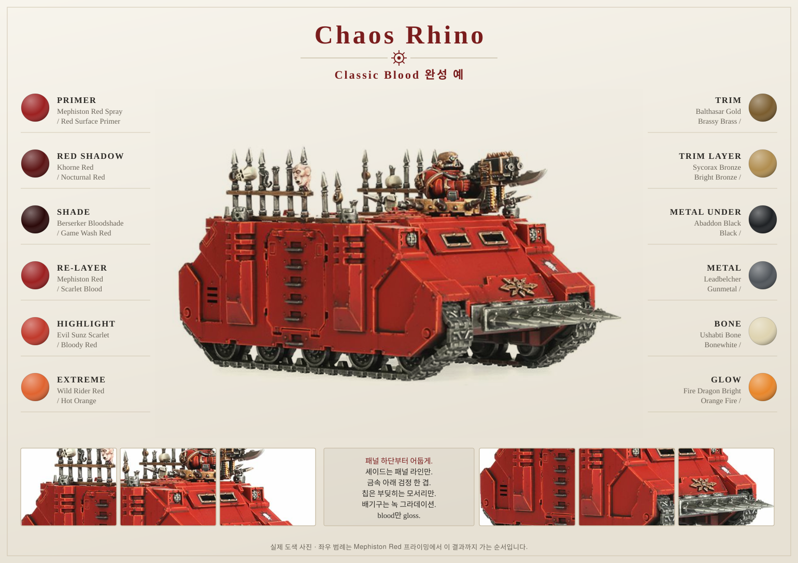

# Chaos Rhino

> 위 사진은 Classic Blood로 완성한 실제 도색 예입니다. 좌우 범례는 `Mephiston Red` 프라이밍에서
> 이 결과까지 가는 순서입니다. 갑옷만 붉고 **brass trim, 강철 블레이드, 어두운 트랙은 각자의 재질**로
> 남아 있다는 점을 보세요 — 프라이머가 전부 붉게 덮은 상태에서 이 분리를 만들어내는 것이 작업의 핵심입니다.

## Introduction

Chaos Rhino는 World Eaters에서 가장 넓은 평면을 가진 모델입니다. 보병처럼 "작은 면을 정확히 칠하는" 작업이 아니라, **큰 판을 지루하지 않게 만드는** 작업입니다. `Mephiston Red Spray`로 프라이밍했다면 갑옷 basecoat는 이미 끝난 상태이므로, 이 문서의 실제 내용은 색을 칠하는 것이 아니라 **음영과 손상을 설계하는 것**입니다.

먼저 [Mephiston Red 프라이밍](../mephiston-red-priming.md)을 읽고 오세요. 색 순서가 [기본 도료 문서](../basic-paints.md)와 반대입니다.

## Painting goals

| 목표 | 설명 |
|---|---|
| 큰 면 살리기 | 패널마다 상단이 밝고 하단이 어두울 것 |
| 무게감 유지 | Classic Blood의 어두운 피색을 잃지 않을 것 |
| 시선점 | 측면 도어의 Khorne 아이콘과 전면 상단 |
| 사용감 | 전차는 새것처럼 보이면 안 됨 |
| 보병과의 통일 | 같은 red 계열, 같은 brass 톤 |

## Difficulty

Intermediate. 붓 컨트롤은 보병보다 쉽지만, **면적 관리와 웨더링 절제**가 어렵습니다.

## Estimated time

| 기준 | 시간 |
|---|---:|
| Tabletop 완성 | 5~8시간 |
| 웨더링 포함 | 10~14시간 |
| Display 수준 | 20시간 이상 |

## Paint list

| 영역 | Citadel | Vallejo 대체 |
|---|---|---|
| Primer | Mephiston Red Spray | Red Surface Primer |
| Red Shadow | Khorne Red | Nocturnal Red |
| Panel Wash | Berserker Bloodshade | Game Wash Red |
| Deep Recess | Nuln Oil | Black Wash |
| Red Re-layer | Mephiston Red | Scarlet Blood |
| Highlight | Evil Sunz Scarlet | Bloody Red |
| Extreme Highlight | Wild Rider Red | Hot Orange |
| Brass Trim | Balthasar Gold / Sycorax Bronze | Brassy Brass / Bright Bronze |
| Metal | Abaddon Black → Leadbelcher | Black → Gunmetal |
| Metal Shade | Nuln Oil | Black Wash |
| Chip Base | Rhinox Hide | Charred Brown |
| Exhaust Rust | Typhus Corrosion / Ryza Rust | Rust Pigment |
| Blood | Blood for the Blood God | Red Gore Gloss |
| Base | Corvus Black / Dawnstone | Charcoal Grey / Cold Grey |

## Tools

- 2호 라운드 브러시 (글레이즈용, 물을 많이 머금는 것)
- 1호 브러시 (패널 복구)
- 0호 디테일 브러시 (엣지 하이라이트)
- 낡은 붓 (드라이브러시, 웨더링)
- 찢은 스펀지 조각 (칩핑)
- 습식 팔레트
- 광택/무광 바니시

## Preparation

1. **조립 전에 서브어셈블리를 나눕니다.** 트랙, 상판 해치, 스톰볼터, 스파이크/체인은 따로 둡니다.
2. 트랙은 빨강이 필요 없으므로 별도로 `Chaos Black` 또는 `Leadbelcher` 스프레이를 씁니다.
3. 측면 도어의 Khorne 아이콘은 조립 전에 칠하는 편이 훨씬 편합니다.
4. 조립 이음새(측면 판, 전면 글래시스)를 퍼티로 메우고 사포로 정리한 뒤 프라이밍합니다.
5. 프라이밍 후 회색 플라스틱이 비치는 곳이 없는지 확인합니다.

> ⚠ 트랙을 차체에 붙인 채로 칠하면 트랙 위쪽과 차체 하단 사이에 붓이 들어가지 않습니다. Rhino에서 가장 흔한 후회입니다.

## Step-by-step workflow

1. `Khorne Red` 글레이즈(물 1:2)를 **패널 하단, 트랙 가드 아래, 해치 그늘, 배기구 주변**에 2~3회 흘려 넣습니다. 아래로 갈수록 한 번씩 더 올립니다.
2. `Berserker Bloodshade`를 패널 라인과 리벳 주변에만 pin wash로 넣습니다. 넓은 면에는 절대 덮지 않습니다.
3. 아주 깊은 틈(볼트 구멍, 해치 경계)에만 `Nuln Oil`을 점으로 넣습니다.

> 셰이드·핀워시·글레이즈의 차이와 농도는 [셰이드, 핀워시, 글레이즈 — 무엇이 다른가](../mephiston-red-priming.md#셰이드-핀워시-글레이즈--무엇이-다른가)에 정리했습니다. 이 세 가지를 구분하지 않으면 차량 측면이 반드시 얼룩집니다.

4. `Mephiston Red`로 **패널 중앙 상단**을 복구합니다. 이 단계에서 밝고 어두운 대비가 처음 눈에 보입니다.
5. `Evil Sunz Scarlet`으로 패널 모서리, 해치 테두리, 전면 경사판 상단 라인을 긋습니다.
6. `Wild Rider Red`는 전면 상단 모서리와 도어 상단 정도로 제한합니다.
7. brass trim은 `Balthasar Gold → Agrax Earthshade → Sycorax Bronze` 순서로 처리합니다.
8. 금속 부위는 `Abaddon Black → Leadbelcher → Nuln Oil → Leadbelcher` 순서입니다. 검정을 빠뜨리면 빨강이 비쳐 구릿빛으로 얼룩집니다.
9. 스펀지에 `Rhinox Hide`를 아주 소량 묻혀 모서리와 하단에 칩핑을 찍고, 그 안쪽에만 `Leadbelcher` 점을 더합니다.
10. 배기구는 `Typhus Corrosion` 후 `Ryza Rust` 드라이브러시, 위로 갈수록 옅게 합니다.
11. 도저 블레이드와 스파이크에 `Blood for the Blood God`을 아주 절제해서 얹습니다.
12. 베이스와 하단 먼지를 마무리하고 바니시합니다.

## Unit recipe

| Stage | Paint | Purpose |
|---|---|---|
| Primer | Mephiston Red Spray | basecoat 생략 |
| Shadow | Khorne Red glaze | 하단과 그늘 |
| Panel Wash | Berserker Bloodshade | 패널 라인만 |
| Deep Recess | Nuln Oil | 볼트 구멍 |
| Re-layer | Mephiston Red | 패널 중앙 복구 |
| Highlight | Evil Sunz Scarlet | 패널 모서리 |
| Extreme Highlight | Wild Rider Red | 전면 상단만 |
| Trim | Balthasar Gold → Sycorax Bronze | 장식 분리 |
| Metal | Abaddon Black → Leadbelcher → Nuln Oil | 트랙, 볼터, 체인 |
| Optional Drybrush | Dawnstone on tracks | 트랙 마모 |
| Optional Weathering | Rhinox Hide sponge, Ryza Rust exhaust | 사용감 |
| Brush-only method | 글레이즈 + 패널 복구 | 가능 |
| Airbrush notes | Khorne Red를 하단 45도에서 얇게 | 시간 대폭 절약 |
| Recommended varnish | Matt 전체, Gloss는 blood에만 | 질감 분리 |

## Marker Tips

| 부위 | 마커 사용 | 이유 |
|---|---|---|
| Rivets | 강력 추천 | 반복 점 작업이 가장 빠름 |
| Trim 초벌 | 권장 | 긴 양각 라인에 유리 |
| Chains, spikes | 권장 | 어두운 금속 초벌 |
| Panel line | 비추천 | 선 두께가 일정해 인공적으로 보임 |
| 큰 갑옷 판 | 절대 비추천 | 스트로크 자국과 광택 차이가 그대로 남음 |

> ⚠ Rhino는 면이 크기 때문에 마커 자국도 크게 보입니다. 마커는 리벳과 trim에서 멈추세요.

## Professional tips

💡 Pro Tip  
차량은 **위가 밝고 아래가 어둡다**는 규칙만 지켜도 완성도가 크게 올라갑니다. 하늘에서 빛이 온다고 가정하고, 지면과 가까운 모든 면을 한 단계 어둡게 두세요.

💡 Pro Tip  
칩핑은 "많이"가 아니라 "부딪히는 곳에만" 넣습니다. 전면 경사판, 도저 블레이드, 도어 모서리, 트랙 가드 하단. 매끈한 측면 중앙에 칩이 있으면 오히려 가짜처럼 보입니다.

💡 Pro Tip  
Rhino를 보병보다 **살짝 어둡게** 마무리하면, 같은 전장에 세웠을 때 보병이 주인공으로 보입니다.

## Common mistakes

- 프라이머를 한 번에 두껍게 뿌려 리벳과 패널 라인이 뭉개지는 것
- `Berserker Bloodshade`를 전체에 덮어 차체가 탁한 자주색이 되는 것
- 하이라이트를 패널 전체에 넓게 칠해 밝은 주황 전차가 되는 것
- 트랙을 조립 후에 칠하려다 붓이 안 들어가는 것
- 웨더링을 균일하게 뿌려 차체가 그냥 더러워 보이는 것

## Troubleshooting

| 문제 | 원인 | 해결 |
|---|---|---|
| 전차가 분홍/주황처럼 밝다 | 그림자 단계 생략 | `Khorne Red` 글레이즈를 하단에 2회 추가 |
| 패널이 밋밋하다 | 상하 대비 부족 | 하단 글레이즈 + 상단 `Mephiston Red` 복구 |
| Wash가 얼룩졌다 | 표면 장력, 과다 도포 | 광택 바니시 후 pin wash로 재작업 |
| 금속이 구릿빛이다 | 빨강 위에 바로 Leadbelcher | `Abaddon Black` 1회 후 재작업 |
| 표면이 가루처럼 거칠다 | 스프레이 시 습도 과다 | 사포 정리 후 재프라이밍 |
| 칩핑이 가짜 같다 | 스펀지에 도료 과다 | 종이에 두 번 찍어낸 뒤 사용 |

## Summary

Rhino는 색을 칠하는 모델이 아니라 **빛과 사용감을 설계하는 모델**입니다. `Mephiston Red` 프라이밍으로 절약한 시간을 글레이즈와 웨더링에 쓰면, 보병과 같은 군대로 보이면서도 훨씬 무겁게 완성됩니다.

## Checklist

- [ ] 트랙과 상판을 서브어셈블리로 분리했다.
- [ ] 하단 글레이즈를 먼저 넣고 하이라이트를 나중에 했다.
- [ ] 셰이드는 패널 라인에만 넣었다.
- [ ] 금속 부위 아래에 검정을 한 겹 깔았다.
- [ ] 칩핑을 부딪히는 모서리에만 넣었다.
- [ ] blood는 gloss, 나머지는 matt으로 분리했다.
