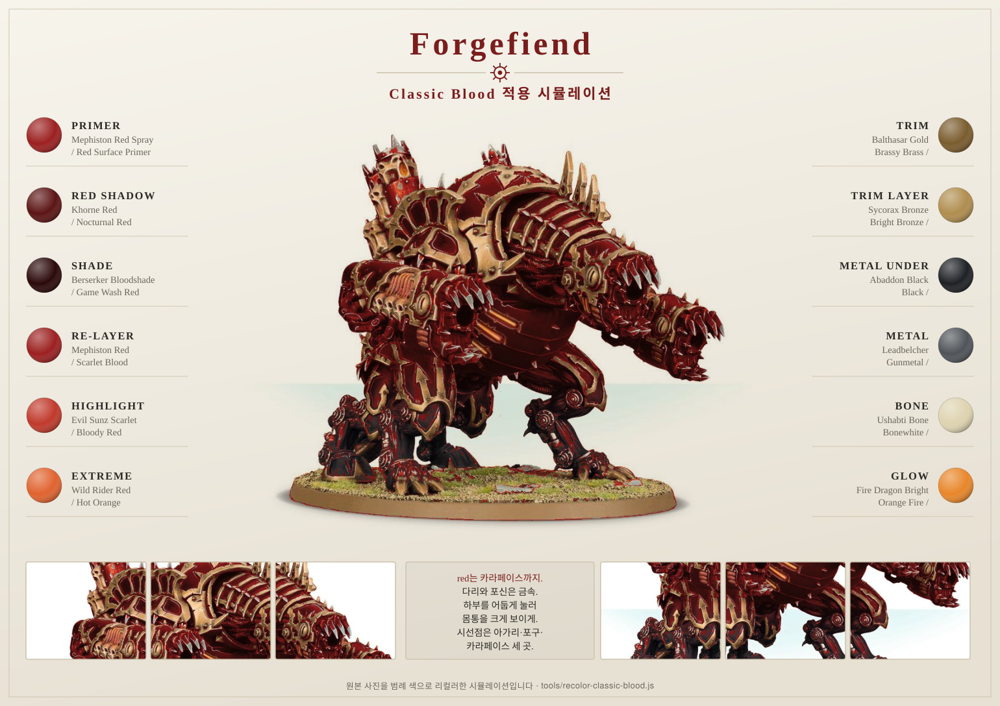

# Forgefiend

> 위 사진은 원본 도색 사진을 Classic Blood 범례 색으로 리컬러한 **시뮬레이션**입니다.
> 갑옷판만 붉게 바꾸고 brass 장갑·강철 발톱·어두운 다리는 원래 재질로 남겼습니다.
> (재현 스크립트 — `tools/recolor-classic-blood.js`)

## Introduction

Forgefiend는 Rhino와 정반대의 문제를 가진 모델입니다. 큰 평면이 아니라 **갑옷판, 기계 골격, 악마 살점, 포신, 뼈와 이빨**이 뒤섞여 있습니다. `Mephiston Red Spray`가 모든 부위를 빨갛게 덮어 놓았기 때문에, 실제 작업의 절반은 "빨강을 되돌려 다른 재질로 만드는 일"입니다.

먼저 [Mephiston Red 프라이밍](../mephiston-red-priming.md)을, 색 기준은 [기본 도료 문서](../basic-paints.md)를 참고하세요.

## Painting goals

| 목표 | 설명 |
|---|---|
| 재질 분리 | 갑옷 red / 골격 metal / 장식 brass / 살점 flesh |
| 붉은 면 축소 | red는 상부 카라페이스와 어깨판 위주 |
| 다리 어둡게 | 하부가 어두워야 상체가 커 보임 |
| 아가리 강조 | 입 안쪽과 이빨이 시선점 |
| 발사구 처리 | ectoplasma를 쓸지, blood-orange로 갈지 결정 |

## Difficulty

Advanced. 색 자체는 어렵지 않지만 **어디를 빨강으로 남길지 결정하는 것**이 어렵습니다.

## Estimated time

| 기준 | 시간 |
|---|---:|
| Tabletop 완성 | 8~12시간 |
| 발광 효과 포함 | 12~16시간 |
| Display 수준 | 25시간 이상 |

## Paint list

| 영역 | Citadel | Vallejo 대체 |
|---|---|---|
| Primer | Mephiston Red Spray | Red Surface Primer |
| Red Shadow | Khorne Red | Nocturnal Red |
| Red Shade | Berserker Bloodshade | Game Wash Red |
| Red Re-layer | Mephiston Red | Scarlet Blood |
| Red Highlight | Evil Sunz Scarlet | Bloody Red |
| Metal Under | Abaddon Black | Black |
| Metal | Leadbelcher → Ironbreaker | Gunmetal → Silver |
| Metal Shade | Nuln Oil | Black Wash |
| Brass | Balthasar Gold → Sycorax Bronze | Brassy Brass → Bright Bronze |
| Brass Shade | Agrax Earthshade | Umber Wash |
| Maw Inner | Rhinox Hide → Khorne Red | Charred Brown → Nocturnal Red |
| Tongue / Flesh | Rakarth Flesh + Druchii Violet | Pale Flesh + Violet Wash |
| Teeth / Horn | Zandri Dust → Ushabti Bone → Screaming Skull | Khaki → Bonewhite → Off White |
| Glow (Khorne) | Jokaero Orange → Fire Dragon Bright → Flash Gitz Yellow | Hot Orange → Orange Fire → Sun Yellow |
| Glow (Warp) | Warpstone Glow → Moot Green → Yellow | Scorpy Green → Livery Green |
| Blood | Blood for the Blood God | Red Gore Gloss |

## Alternative paints

| 역할 | Vallejo | Citadel | AK Interactive | Army Painter |
|---|---|---|---|---|
| Dark Red | Nocturnal Red | Khorne Red | Dark Red | Dragon Red |
| Mid Red | Scarlet Blood | Mephiston Red | Red | Pure Red |
| Red Edge | Bloody Red | Evil Sunz Scarlet | Bright Red | Lava Orange |
| Brass | Brassy Brass | Balthasar Gold | Old Bronze | Weapon Bronze |
| Steel | Gunmetal | Leadbelcher | Gun Metal | Gun Metal |
| Bone | Bonewhite | Ushabti Bone | Bone | Skeleton Bone |

## Tools

- 2호 글레이즈 브러시
- 1호 브러시
- 0호 디테일 브러시 (이빨, 발사구)
- 낡은 붓 (드라이브러시)
- 습식 팔레트
- 서브어셈블리 홀더 또는 코르크

## Preparation

1. **다리 4개, 상부 카라페이스, 포신을 분리한 채로 프라이밍합니다.** 조립 후에는 다리 안쪽과 배 아래에 붓이 들어가지 않습니다.
2. 스프레이는 뒤집어서 배 아래와 다리 안쪽에 한 번 더 뿌립니다.
3. 아가리(maw)는 조립 전에 안쪽까지 칠합니다.
4. 어떤 면을 red로 남길지 먼저 정합니다. 아래 배분을 권장합니다.

| 부위 | 재질 |
|---|---|
| 상부 카라페이스, 어깨판, 큰 장갑판 | Red armor |
| 다리, 관절, 피스톤, 포신 | Blackened steel |
| 테두리, 뿔 장식, Khorne 아이콘 | Aged brass |
| 아가리 안쪽, 혀, 노출된 근육 | Flesh |
| 이빨, 뿔, 스컬 | Bone |

> ⚠ Forgefiend 전체를 빨강으로 두면 실루엣이 하나의 붉은 덩어리로 뭉칩니다. **red는 절반 이하**로 제한하세요.

## Step-by-step workflow

1. red로 남길 갑옷판을 정하고, 나머지 부위는 `Abaddon Black`으로 덮습니다. 이 검정이 이후 금속의 바탕이 됩니다.
2. 갑옷판 하단과 판 사이 틈에 `Khorne Red` 글레이즈(물 1:2)를 2~3회 흘려 넣습니다. 다리와 가까울수록 더 어둡게 갑니다.
3. `Berserker Bloodshade`를 갑옷판 경계와 리벳 주변에만 넣습니다.

> 셰이드·핀워시·글레이즈의 차이와 농도는 [셰이드, 핀워시, 글레이즈 — 무엇이 다른가](../mephiston-red-priming.md#셰이드-핀워시-글레이즈--무엇이-다른가)를 참고하세요.

4. `Mephiston Red`로 카라페이스 상단과 어깨판 중앙을 복구합니다.
5. `Evil Sunz Scarlet`으로 갑옷판 모서리를, `Wild Rider Red`는 카라페이스 최상단 두세 곳에만 넣습니다.
6. 금속은 `Leadbelcher → Nuln Oil → Leadbelcher` 순서로 처리하고, 발톱 끝과 피스톤 상단에만 `Ironbreaker`를 올립니다.
7. brass는 `Balthasar Gold → Agrax Earthshade → Sycorax Bronze`로 처리합니다. 넓게 쓰지 말고 테두리와 아이콘에만 씁니다.
8. 아가리 안쪽은 `Rhinox Hide → Khorne Red` 순서로 어둡게 두고, 혀와 살점만 `Rakarth Flesh → Druchii Violet → Flayed One Flesh`로 밝힙니다.
9. 이빨과 뿔은 `Zandri Dust → Agrax Earthshade → Ushabti Bone → Screaming Skull`로 마무리합니다.
10. 포구는 아래 발광 옵션 중 하나를 선택합니다.
11. `Blood for the Blood God`을 아가리 주변과 발톱 끝에만 얹습니다.
12. 다리 하단에 베이스와 같은 색으로 먼지를 살짝 올려 지면과 연결합니다.

### 발광 옵션

| 옵션 | 색 순서 | 인상 |
|---|---|---|
| Khorne blood-orange | Jokaero Orange → Fire Dragon Bright → Flash Gitz Yellow (중심) | 붉은 갑옷과 통일감, 용광로 느낌 |
| Warp green | Warpstone Glow → Moot Green → Yellow (중심) | 빨강의 보색이라 대비가 가장 강함 |

💡 Pro Tip  
녹색은 빨강의 보색이라 **가장 눈에 띕니다.** 군대 안에서 Forgefiend를 주인공으로 세우고 싶으면 녹색, 무리에 자연스럽게 섞고 싶으면 blood-orange를 고르세요. 무엇을 고르든 **군대 전체에서 같은 색으로 통일**해야 합니다.

발광 부위는 주변 금속에도 색이 반사됩니다. 포구 안쪽을 칠한 뒤, 바로 바깥 금속 테두리에 같은 색을 아주 묽게 한 번 글레이즈하면 진짜 빛나는 것처럼 보입니다.

## Unit recipe

| Stage | Paint | Purpose |
|---|---|---|
| Primer | Mephiston Red Spray | 갑옷 basecoat 생략 |
| Mask by black | Abaddon Black | 금속 예정 부위 덮기 |
| Shadow | Khorne Red glaze | 갑옷 하단과 틈 |
| Shade | Berserker Bloodshade | 판 경계 |
| Re-layer | Mephiston Red | 카라페이스 상단 |
| Highlight | Evil Sunz Scarlet | 갑옷판 모서리 |
| Extreme Highlight | Wild Rider Red | 최상단 2~3곳 |
| Metal | Leadbelcher → Nuln Oil → Ironbreaker | 다리, 포신, 발톱 |
| Brass | Balthasar Gold → Agrax → Sycorax Bronze | 테두리와 아이콘 |
| Flesh | Rakarth Flesh → Druchii Violet → Flayed One Flesh | 혀, 근육 |
| Bone | Zandri Dust → Ushabti Bone → Screaming Skull | 이빨, 뿔 |
| Glow | 선택한 발광 세트 | 포구 |
| Optional Drybrush | Dawnstone on legs | 하부 마모 |
| Optional Weathering | Rhinox Hide sponge on plates | 전투 손상 |
| Brush-only method | 전 과정 가능 | 면이 작아 붓으로 충분 |
| Airbrush notes | Khorne Red를 하단에서, 발광은 포구 주변에 | 시간 절약 |
| Recommended varnish | Matt 전체, Gloss는 blood와 발광부에만 | 질감 분리 |

## Marker Tips

| 부위 | 마커 사용 | 이유 |
|---|---|---|
| Rivets | 강력 추천 | 반복 점 작업 |
| Brass 테두리 초벌 | 권장 | 얇고 긴 양각 |
| 피스톤, 관절 | 권장 | 어두운 금속 초벌 |
| 이빨 | 비추천 | 뼈 그라데이션이 뭉개짐 |
| 아가리 살점 | 비추천 | 부드러운 전이가 사라짐 |
| 카라페이스 큰 판 | 비추천 | 스트로크 자국 |

## Professional tips

💡 Pro Tip  
Forgefiend는 **아래가 어둡고 위가 밝을 때** 가장 커 보입니다. 다리를 어둡게 눌러두면 몸통이 실제보다 크게 읽힙니다.

💡 Pro Tip  
시선점을 세 곳으로 제한하세요. **아가리, 포구, 카라페이스 상단.** 이 세 곳만 선명해도 나머지는 배경으로 잘 작동합니다.

💡 Pro Tip  
Rhino와 Forgefiend를 나란히 놓았을 때 red 톤이 같은지 확인하세요. 같은 프라이머를 썼어도 글레이즈 횟수가 다르면 다른 군대처럼 보입니다.

## Common mistakes

- 프라이머가 빨갛다는 이유로 모델 전체를 빨강으로 마무리하는 것
- 다리와 포신까지 밝게 칠해 실루엣이 뭉치는 것
- 빨강 위에 바로 `Leadbelcher`를 올려 구릿빛으로 얼룩지는 것
- brass를 넓게 써서 갑옷보다 먼저 보이는 것
- 발광 효과를 포구 안쪽에만 칠하고 주변 반사를 생략하는 것
- `Blood for the Blood God`을 전신에 뿌려 무엇이 상처인지 알 수 없게 만드는 것

## Troubleshooting

| 문제 | 원인 | 해결 |
|---|---|---|
| 실루엣이 뭉친다 | red 면적 과다 | 다리와 관절을 금속으로 되돌림 |
| 모델이 작아 보인다 | 하부가 밝음 | 다리에 `Khorne Red` 또는 `Nuln Oil` 글레이즈 |
| 금속이 얼룩진다 | 검정 basecoat 생략 | `Abaddon Black` 1회 후 재작업 |
| 발광이 스티커 같다 | 주변 반사 없음 | 포구 바깥에 묽은 글레이즈 1회 |
| 이빨이 노랗게 뜬다 | Agrax 과다 | `Ushabti Bone` 재레이어 후 끝점만 밝힘 |
| 아가리가 안 보인다 | 안쪽이 밝음 | `Rhinox Hide`로 목 안쪽을 더 어둡게 |

## Summary

Forgefiend는 "빨강을 얼마나 잘 칠하느냐"가 아니라 **"빨강을 어디서 멈추느냐"**의 모델입니다. 갑옷판만 red로 남기고 다리와 포신을 어두운 금속으로 눌러주면, 같은 프라이머를 쓴 Rhino와 자연스럽게 한 군대로 묶입니다.

## Checklist

- [ ] 다리와 카라페이스를 분리한 채 프라이밍했다.
- [ ] red로 남길 부위와 금속으로 바꿀 부위를 미리 정했다.
- [ ] 금속 부위에 검정 basecoat를 깔았다.
- [ ] 하부를 상부보다 어둡게 유지했다.
- [ ] 발광 색을 군대 전체 기준으로 통일했다.
- [ ] 시선점을 아가리, 포구, 카라페이스 세 곳으로 제한했다.
- [ ] Rhino와 red 톤을 나란히 비교했다.
